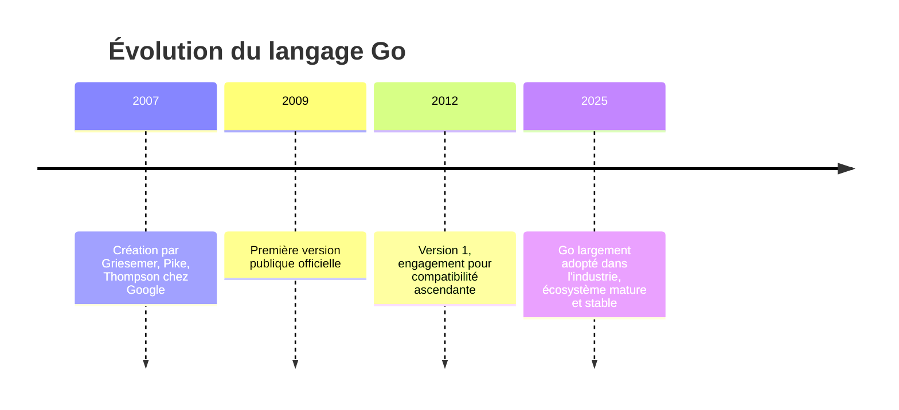

# 1- Introduction au Go & bases du langage  
## 1- Présentation du langage Go  
### 1- Histoire et contexte de Go  

---

## Origines et contexte de création  

Le langage Go, souvent appelé Golang, a été conçu en 2007 chez Google par trois ingénieurs renommés : **Robert Griesemer, Rob Pike, et Ken Thompson**. Ces noms ne sont pas inconnus dans le monde informatique : Ken Thompson est co-inventeur d'UNIX et, avec Rob Pike, a participé au développement de UTF-8, le standard universel d'encodage des caractères.

### Pourquoi créer Go ?  
À l'époque, Google utilisait principalement le C++ pour ses projets. Ce langage, bien que puissant, posait des problèmes de **complexité**, de **lenteur dans les temps de compilation** et de **maintenance difficile pour de très grandes bases de code** travaillées par des équipes nombreuses. Les langages de script comme Python, quant à eux, permettaient un développement rapide mais manquaient de performance et de rigueur pour la production à grande échelle.

**Go a donc été conçu pour offrir :**  
- La simplicité et la clarté dans la syntaxe,  
- La vitesse d'exécution comparable aux langages compilés comme C++,  
- Un modèle de concurrence performant via les "goroutines",  
- Une gestion moderne des dépendances et une compilation rapide,  
- Une compatibilité ascendante garantie depuis sa version 1 (2012).  

Go combine ainsi les avantages des langages compilés et la productivité des langages modernes, ce qui le rend adapté à la création de systèmes logiciels à grande échelle.

---

## Chronologie simplifiée



---

## Caractéristiques principales illustrées  

### Exemple : Hello World en Go

```go
package main

import "fmt"

func main() {
    fmt.Println("Hello, Go!")
}
```

**Explication :**  
- `package main` définit un programme exécutable,  
- `import "fmt"` importe le package standard pour l'affichage,  
- La fonction `main` est le point d'entrée,  
- `fmt.Println` affiche une chaîne de caractères.

### Concurrence simplifiée avec les goroutines

```go
package main

import (
    "fmt"
    "time"
)

func say(s string) {
    for i := 0; i < 3; i++ {
        fmt.Println(s)
        time.Sleep(100 * time.Millisecond)
    }
}

func main() {
    go say("Hello")
    say("World")
}
```

**Explication :**  
- `go say("Hello")` lance la fonction `say` en goroutine (thread léger),  
- Le programme affiche intercalé "Hello" et "World", démontrant la gestion native de la concurrence.

---

## En résumé  
Le langage Go a été pensé pour répondre aux besoins contemporains des développeurs de logiciels complexes à grande échelle. Il met l'accent sur la simplicité et la robustesse, avec des outils intégrés pour la gestion de la concurrence, la rapidité de compilation, et une évolution maîtrisée pour garantir la stabilité des projets.

---

## Sources  

- Encyclopaedia Britannica, "Go | Programming Language, Features, & Facts":  
  https://www.britannica.com/technology/Go-programming-language (consulté 2025)  
- Tencent Cloud Techpedia, "What is the history and background of the Go language?":  
  https://www.tencentcloud.com/techpedia/101475  
- ByteSizeGo, "The Evolution of the Go Programming Language":  
  https://www.bytesizego.com/blog/go-language-history  
- ACM Communications, "The Go Programming Language and Environment":  
  https://cacm.acm.org/research/the-go-programming-language-and-environment  
- GeeksforGeeks, "Go Programming Language (Introduction)":  
  https://www.geeksforgeeks.org/go-language/go-programming-language-introduction  

---

Ce cours pose ainsi les bases nécessaires pour comprendre l'origine et les motivations derrière Go, ce qui vous aidera à mieux appréhender son écosystème et sa philosophie dans les prochaines séances.