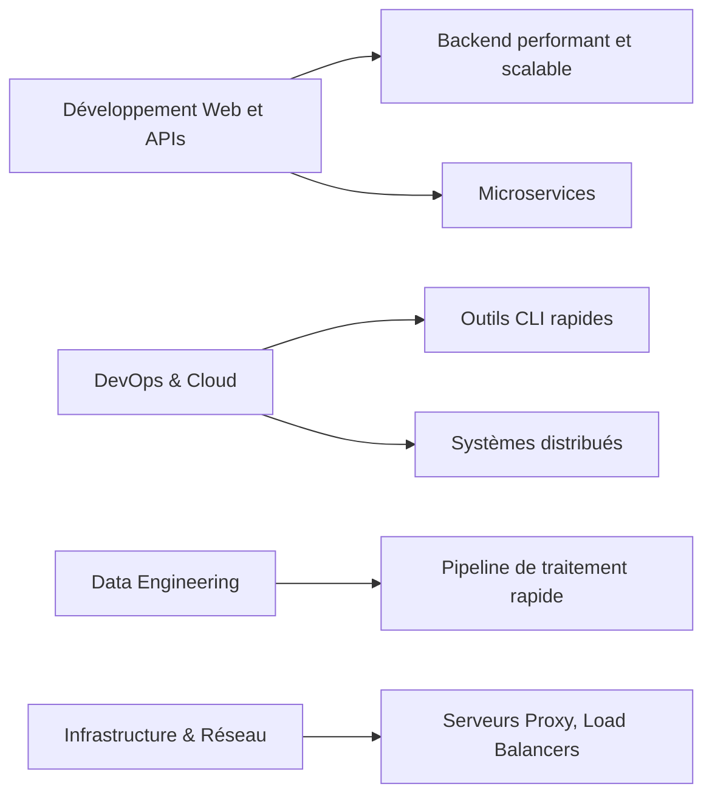

# 1- Introduction au Go & bases du langage  
## 1- Présentation du langage Go  
### 2- Les avantages et cas d'utilisation de Go  

---

## 1. Les avantages majeurs de Go  

### a) Simplicité et lisibilité du code  
Go privilégie une syntaxe claire et minimaliste. Le langage évite les complexités inutiles comme l’héritage multiple, les exceptions, ou les macros. Le code Go est facile à lire, à comprendre et à maintenir.

---

### b) Performance proche du langage natif  
Go est un langage compilé. Son compilateur génère du code machine optimisé, ce qui permet d’atteindre des performances comparables à celles du C/C++. La compilation est aussi particulièrement rapide, même pour de gros projets.

---

### c) Gestion efficace de la concurrence  
Go utilise un modèle de concurrence basé sur les goroutines — des threads légers gérés par le runtime Go. La communication entre goroutines se fait via des canaux ("channels"), ce qui simplifie la programmation parallèle sans les risques classiques des threads (deadlocks, conditions de course).

---

### d) Écosystème riche et standardisé  
Go dispose d’une bibliothèque standard puissante, incluant le support réseau, la gestion des fichiers, la cryptographie, etc. Le système de gestion des dépendances (modules Go) est simple et intégré.

---

### e) Compilation multi-plateforme  
Le compilateur Go peut cross-compiler facilement pour différents systèmes d’exploitation et architectures CPU (Linux, Windows, macOS, ARM, etc.) sans configuration complexe.

---

### f) Déploiement simplifié grâce aux binaires statiques  
Go produit des exécutables statiques incluant toutes les dépendances nécessaires, ce qui facilite le déploiement sans avoir à gérer de runtime ou bibliothèques externes.

---

## 2. Cas d'utilisation typiques de Go  



---

### a) Serveurs Web et API performants  
Go est largement utilisé pour construire des serveurs web qui doivent gérer des milliers de connexions simultanées avec une faible latence, grâce à ses goroutines et à sa gestion efficace des requêtes réseau.

**Exemple avec un serveur HTTP basique en Go :**

```go
package main

import (
    "fmt"
    "net/http"
)

func handler(w http.ResponseWriter, r *http.Request) {
    fmt.Fprintf(w, "Hello, %s!", r.URL.Path[1:])
}

func main() {
    http.HandleFunc("/", handler)
    http.ListenAndServe(":8080", nil)
}
```

---

### b) Microservices  
La simplicité, la rapidité de compilation, la gestion naturelle de la concurrence font de Go un excellent choix pour développer des microservices légers, faciles à maintenir.

---

### c) Outils en ligne de commande (CLI)  
Go compile vers un binaire unique et statique. Ceci est idéal pour les outils en ligne de commande qui doivent fonctionner sans dépendances externes, sur plusieurs plateformes.

---

### d) Cloud et infrastructures   
De nombreux projets Cloud natifs (Kubernetes, Docker, Terraform) sont écrits en Go, preuve de son efficacité pour les systèmes distribués, l’orchestration, et les infrastructures.

---

### e) Traitement de données et pipeline  
Les performances et la simplicité en font un choix pertinent pour manipuler et traiter efficacement d’importants volumes de données.

---

## 3. Illustration concrète : gestion simple de la concurrence  

```go
package main

import (
    "fmt"
    "time"
)

func worker(id int, c chan string) {
    for i := 0; i < 3; i++ {
        msg := fmt.Sprintf("Worker %d - tâche %d", id, i)
        c <- msg
        time.Sleep(time.Millisecond * 100)
    }
    close(c)
}

func main() {
    c := make(chan string)

    go worker(1, c)

    for msg := range c {
        fmt.Println(msg)
    }
}
```

Ce code montre comment les goroutines et canaux simplifient la communication et la synchronisation entre tâches concurrentes.

---

## Sources utilisées  

- Go Language Official site, "Why Go?": https://go.dev/doc/faq#why_go  
- The New Stack, "Why Google Created Go": https://thenewstack.io/why-google-created-go-programming-language/  
- GitHub, Kubernetes repo (exemple d’application Go dans le cloud) : https://github.com/kubernetes/kubernetes  
- DigitalOcean, "A Beginner’s Guide to Go": https://www.digitalocean.com/community/tutorial_series/a-beginner-s-guide-to-go  
- Medium, "Real-world Use Cases for Go Language": https://medium.com/@amit.thewheelers/real-world-use-cases-for-go-f2e1f247ccc3  
- Go By Example, "Goroutines and Channels": https://gobyexample.com/goroutines  

---

Ce cours synthétise les forces de Go qui expliquent sa popularité croissante dans le développement moderne, particulièrement dans l’écosystème cloud et la programmation serveur.