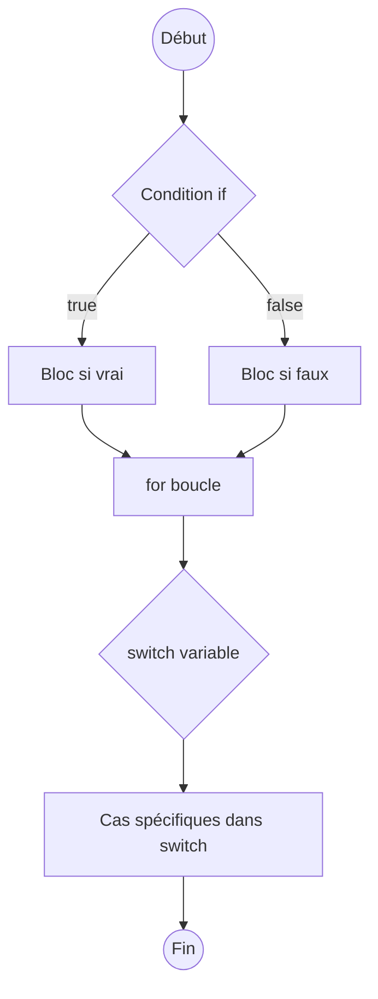

# 1- Introduction au Go & bases du langage  
## 2- Bases du langage Go  
### 2- Structures de contrôle (if, for, switch)  

---

## 1. La structure conditionnelle `if`  

En Go, l'instruction `if` évalue une condition booléenne et exécute un bloc de code si cette condition est vraie.

### Syntaxe simple

```go
if condition {
    // instructions exécutées si condition est vraie
}
```

### Exemple

```go
package main
import "fmt"

func main() {
    age := 20
    if age >= 18 {
        fmt.Println("Adulte")
    }
}
```

### `if` avec une instruction simple avant la condition

Go permet d’exécuter une instruction avant la condition dans la même ligne, utile pour limiter la portée d’une variable.

```go
if err := doSomething(); err != nil {
    fmt.Println("Erreur:", err)
}
```

---

## 2. La boucle `for`  

`for` est la seule structure de boucle en Go. Elle est très flexible et peut remplacer `while`, `do-while` ou les boucles traditionnelles.

### a) La boucle `for` classique

```go
for i := 0; i < 5; i++ {
    fmt.Println(i)
}
```

Cette syntaxe comporte trois parties : initialisation, condition, post-instruction.

### b) Boucle `for` type `while`

Sans initialisation et post-instruction, la boucle fonctionne comme un `while`.

```go
i := 0
for i < 5 {
    fmt.Println(i)
    i++
}
```

### c) Boucle infinie

```go
for {
    // boucle infinie
}
```

Utile en conjonction avec un `break` pour sortir.

---

## 3. La structure `switch`  

Permet de tester une variable contre plusieurs cas possibles, syntaxe plus claire qu’une longue chaîne de `if-else`.

### Syntaxe basique

```go
switch variable {
case valeur1:
    // bloc 1
case valeur2:
    // bloc 2
default:
    // bloc par défaut
}
```

### Exemple

```go
package main
import "fmt"

func main() {
    day := "mardi"

    switch day {
    case "lundi":
        fmt.Println("Début de la semaine")
    case "mardi", "mercredi":
        fmt.Println("Milieu de semaine")
    case "samedi", "dimanche":
        fmt.Println("Weekend!")
    default:
        fmt.Println("Jour inconnu")
    }
}
```

### Particularités

- Pas besoin de `break` explicite (pas de "fall-through" par défaut).
- On peut utiliser `fallthrough` pour forcer l'exécution du cas suivant.

---

## 4. Diagramme Mermaid illustrant la structure de contrôle



---

## 5. Résumé des particularités  

| Structure | Remarques | Syntaxe importante |  
|-----------|------------|--------------------|  
| `if`      | Permet une déclaration avant condition | `if v := expr(); v > 0 {}` |  
| `for`     | La seule boucle, variations multiples | `for i:=0;i<10;i++ {}`, `for condition {}` |  
| `switch`  | Pas besoin de `break`, cas multiples | `switch x { case 1,2: ... default: ... }` |  

---

## Sources  

- Documentation officielle Go, "Flow control": https://go.dev/doc/effective_go#control-structures  
- Tour of Go, "Flow control statements": https://go.dev/tour/controlflow/1  
- Go by Example, "If/Else": https://gobyexample.com/if-else  
- Go by Example, "For loop": https://gobyexample.com/for  
- Go by Example, "Switch": https://gobyexample.com/switch  

---

Ce cours présente l’essentiel des structures de contrôle dans Go. Leur compréhension permet de maîtriser le flux d’exécution dans vos programmes avec clarté et efficacité.