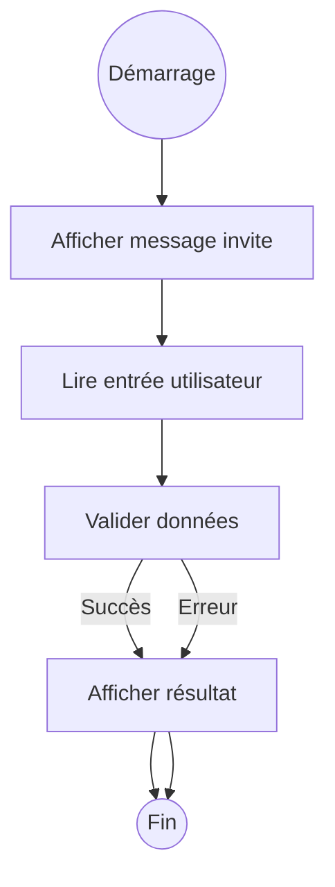

# 1- Introduction au Go & bases du langage  
## 2- Bases du langage Go  
### 3- Entrée et sortie simples (print, scan)  

---

## 1. Affichage simple avec les fonctions `print` et `fmt`

En Go, le package standard **`fmt`** (format) fournit les fonctions les plus courantes pour l’affichage, aussi bien sur la console que sur d’autres flux.

### a) `fmt.Print` et `fmt.Println`  

- `fmt.Print()` affiche les arguments sans ajouter de saut de ligne.  
- `fmt.Println()` affiche les arguments et ajoute un saut de ligne automatiquement.  

**Exemple :**

```go
package main

import "fmt"

func main() {
    fmt.Print("Bonjour ")
    fmt.Print("le monde!")
    fmt.Println(" Ceci sera sur la même ligne.")
    fmt.Println("Et ici, on passe à la ligne suivante.")
}
```

Sortie :

```
Bonjour le monde! Ceci sera sur la même ligne.
Et ici, on passe à la ligne suivante.
```

---

### b) `fmt.Printf` — affichage formaté  

Permet d’utiliser des verbes de formatage (`%d` pour entier, `%s` pour chaîne, `%f` pour flottant, etc.).

**Exemple :**

```go
fmt.Printf("Valeur entière : %d, texte : %s, flottant : %.2f\n", 42, "exemple", 3.14159)
```

Sortie :

```
Valeur entière : 42, texte : exemple, flottant : 3.14
```

---

## 2. Lecture de données avec `fmt.Scan` et variantes  

Le package `fmt` inclut des fonctions pour lire l'entrée standard (clavier).

### a) `fmt.Scan`  

Lit les entrées séparées par des espaces et les stocke dans des variables passées en référence.

**Exemple :**

```go
package main

import "fmt"

func main() {
    var name string
    var age int

    fmt.Print("Entrez votre nom : ")
    fmt.Scan(&name) // & pour passer l'adresse

    fmt.Print("Entrez votre âge : ")
    fmt.Scan(&age)

    fmt.Printf("Nom: %s, Âge: %d\n", name, age)
}
```

---

### b) `fmt.Scanln`  

Similaire à `Scan` mais lit jusqu’à la fin de la ligne. Pratique pour lire une seule ligne complète.

---

### c) `fmt.Sscan` et variantes

Pour lire depuis une chaîne au lieu de l’entrée standard.

---

## 3. Gestion des erreurs de lecture  

`fmt.Scan` retourne le nombre d’éléments lus et une erreur qu’il faut vérifier.

```go
n, err := fmt.Scan(&name)
if err != nil {
    fmt.Println("Erreur lors de la lecture :", err)
    return
}
fmt.Printf("Valeurs lues : %d\n", n)
```

---

## 4. Exemple complet combiné

```go
package main

import "fmt"

func main() {
    var age int
    fmt.Print("Entrez votre âge : ")
    // Lire un int avec contrôle d'erreur
    if _, err := fmt.Scan(&age); err != nil {
        fmt.Println("Entrée invalide :", err)
        return
    }
    fmt.Printf("Vous avez %d ans.\n", age)
}
```

---

## 5. Diagramme Mermaid - processus d'entrée/sortie simple



---

## Sources utilisées  

- Documentation Go, package fmt: https://pkg.go.dev/fmt  
- Tour of Go, "Basic Data Types": https://go.dev/tour/basics/10  
- Go by Example, "Scanning user input": https://gobyexample.com/reading-input  
- Stack Overflow, "Best way to read user input in Go": https://stackoverflow.com/questions/28070899/how-to-read-input-from-console-in-golang  

---

Ce cours détaille les commandes fondamentales des entrées/sorties en Go, permettant d’échanger simplement avec l’utilisateur via la console.