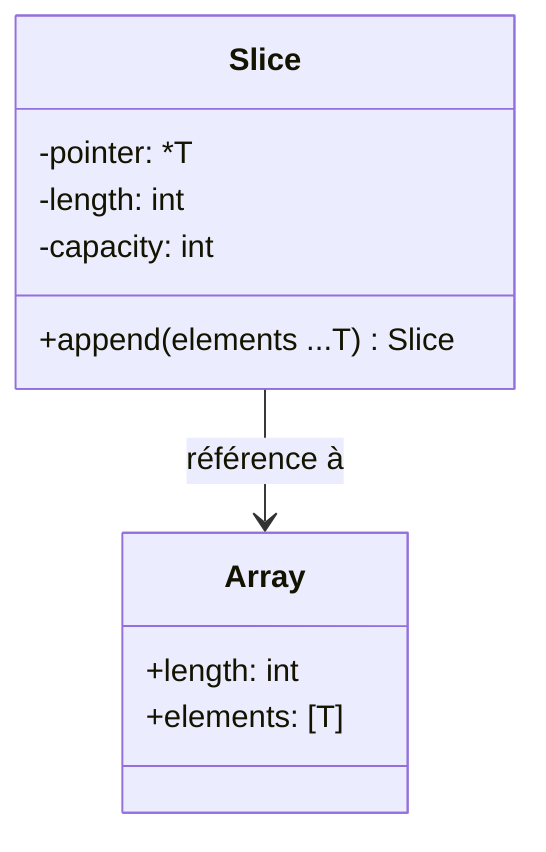

# 2- Collections, fonctions et erreurs  
## 1- Collections en Go  
### 1- Tableaux et slices : déclaration, manipulation  

---

## 1. Tableaux en Go  

Un **tableau** en Go est une séquence de taille fixe d’éléments du même type.

### Déclaration

```go
var arr [5]int       // tableau de 5 entiers initialisés à 0
arr2 := [3]string{"a", "b", "c"} // déclaration et initialisation
```

### Particularités

- Taille fixe et partie intégrante du type : `[5]int` est différent de `[10]int`.  
- Taille connue à la compilation.  

### Accès et modification

```go
arr[0] = 42
fmt.Println(arr[0])   // affiche 42
```

### Parcours

```go
for i, v := range arr {
    fmt.Println(i, v)
}
```

---

## 2. Slices : une abstraction dynamique sur les tableaux  

Les **slices** sont des structures dynamiques plus flexibles que les tableaux.

### Qu'est-ce qu'une slice ?

Une slice décrit une portion continue d’un tableau. Elle contient :  
- un pointeur vers le tableau sous-jacent,  
- une longueur (length),  
- une capacité (capacity).

---

### Déclaration et initialisation de slices

```go
var s []int           // slice vide, nil
s2 := make([]int, 5)  // slice de 5 entiers initialisés à 0
s3 := []string{"x", "y", "z"}  // slice littérale
```

### Conversion tableau → slice

```go
arr := [4]int{1,2,3,4}
sl := arr[1:3]  // slice contenant {2,3}
```

---

### Accès et modification  

Comme pour les tableaux :

```go
s[0] = 10
fmt.Println(s[0])
```

### Extension avec `append`

Les slices sont extensibles via la fonction intégrée `append` :

```go
var s []int
s = append(s, 1)
s = append(s, 2, 3)
```

`append` peut réallouer et copier le tableau sous-jacent si la capacité est dépassée.

---

### Copie de slices

Pour copier le contenu d’une slice dans une autre :

```go
src := []int{1,2,3}
dst := make([]int, len(src))
copy(dst, src)
```

---

## 3. Illustration avec code complet  

```go
package main

import "fmt"

func main() {
    // Déclaration d'un tableau
    var tab [3]int = [3]int{10, 20, 30}
    fmt.Println("Tableau:", tab)

    // Déclaration d'une slice
    slice := []int{1, 2, 3}
    fmt.Println("Slice:", slice)

    // Slice d'un tableau
    s := tab[1:3]
    fmt.Println("Slice sur tableau:", s)

    // Modification slice modifie le tableau sous-jacent
    s[0] = 100
    fmt.Println("Tableau après modification slice:", tab)

    // Append sur slice (peut réallouer)
    slice = append(slice, 4, 5)
    fmt.Println("Slice après append:", slice)
}
```

---

## 4. Diagramme Mermaid - structure relationnelle



---

## 5. Points clés  

| Concept       | Description                                       |
|---------------|-------------------------------------------------|
| Tableau       | Taille fixe, allocation statique                 |
| Slice         | Taille dynamique, référence à un tableau sous-jacent |
| `append`      | Ajouter des éléments à une slice, possible réallocation  |
| `copy`        | Copier les éléments entre slices                   |

---

## Sources  

- Documentation officielle Go, Arrays and Slices: https://go.dev/doc/effective_go#arrays_and_slices  
- Tour of Go, "Arrays and Slices": https://go.dev/tour/moretypes/7  
- Go by Example, "Arrays": https://gobyexample.com/arrays  
- Go by Example, "Slices": https://gobyexample.com/slices  
- Stack Overflow, "What is the difference between arrays and slices in Go?": https://stackoverflow.com/questions/34671245/what-is-the-difference-between-arrays-and-slices-in-go  

---

Ce cours présente l’essentiel des tableaux et slices en Go, fondation des structures de données pour la manipulation efficace des collections.