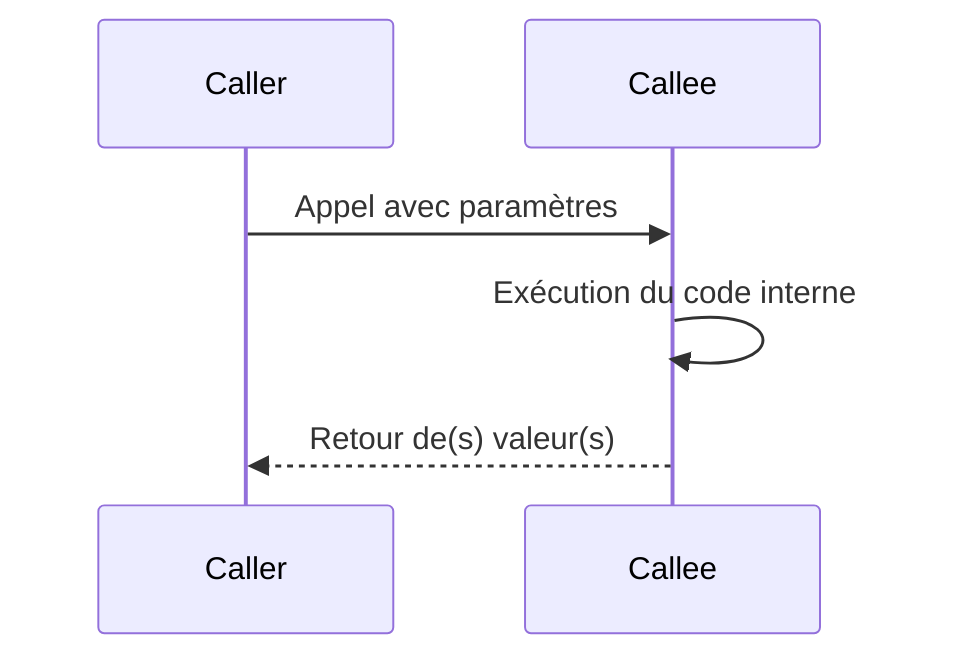

# 2- Collections, fonctions et erreurs  
## 2- Fonctions  
### 1- Définition et appel de fonctions  

---

## 1. Définir une fonction en Go  

En Go, une fonction est une séquence d’instructions qui peut prendre des paramètres, retourner des valeurs et être appelée depuis d’autres parties du programme.

### Syntaxe générale

```go
func nomFonction(param1 type1, param2 type2) retourType {
    // corps de la fonction
    return valeur
}
```

- Le mot-clé `func` introduit la fonction.  
- Les paramètres sont listés avec leur nom puis leur type.  
- Le type de retour est indiqué après la parenthèse de paramètres.  
- Pour une fonction sans valeur de retour, ne rien mettre après la parenthèse.

---

## 2. Exemple simple de fonction  

```go
package main

import "fmt"

func addition(a int, b int) int {
    return a + b
}

func main() {
    res := addition(10, 5)
    fmt.Println("Résultat :", res)
}
```

---

## 3. Particularités et variantes  

### a) Plusieurs retours  

Go supporte plusieurs valeurs de retour, fréquemment utilisées pour retourner un résultat avec une erreur.

```go
func diviser(a, b float64) (float64, error) {
    if b == 0 {
        return 0, fmt.Errorf("division par zéro")
    }
    return a / b, nil
}
```

### b) Types des paramètres similaires  

Les paramètres adjacents de même type peuvent être regroupés.

```go
func ajouter(x, y int) int {
    return x + y
}
```

---

## 4. Appel de fonction  

Il suffit d'utiliser le nom avec ses arguments.

```go
resultat := addition(3, 4)
```

---

## 5. Fonctions sans retour  

Exemple :

```go
func afficherMessage(msg string) {
    fmt.Println(msg)
}
```

---

## 6. Fonctions anonymes et affectation à des variables  

Go permet de déclarer des fonctions sans nom (fonction littérale) et les affecter à des variables.

```go
f := func(x int) int {
    return x * x
}
fmt.Println(f(5))  // 25
```

---

## 7. Exemple combiné  

```go
package main

import "fmt"

func multiplication(a, b int) int {
    return a * b
}

func main() {
    f := func(msg string) {
        fmt.Println(msg)
    }

    fmt.Println("3 * 4 =", multiplication(3, 4))
    f("Fonction anonyme appelée")
}
```

---

## 8. Diagramme Mermaid : cycle de vie d’un appel de fonction  



---

## 9. Résumé des éléments clés  

| Élément               | Description                           |
|-----------------------|-------------------------------------|
| `func`                | Mot-clé pour définir une fonction   |
| Paramètres            | Variables d’entrée de la fonction   |
| Valeur ou valeurs de retour | Ce que la fonction renvoie       |
| Plusieurs retours     | Possible via `(type1, type2, ...)` |
| Fonctions anonymes    | Fonctions sans nom, affectables     |
| Appel                 | Nom de la fonction + arguments      |

---

## Sources  

- Tour of Go, "Functions": https://go.dev/tour/basics/4  
- Documentation officielle Go, "Functions": https://golang.org/ref/spec#Function_declarations  
- Go by Example, "Functions": https://gobyexample.com/functions  
- Go Blog, "Effective Go – Functions": https://golang.org/doc/effective_go#functions  

---

Ce cours présente la définition et l’appel de fonctions en Go, fondamental pour structurer un programme et réutiliser du code proprement.