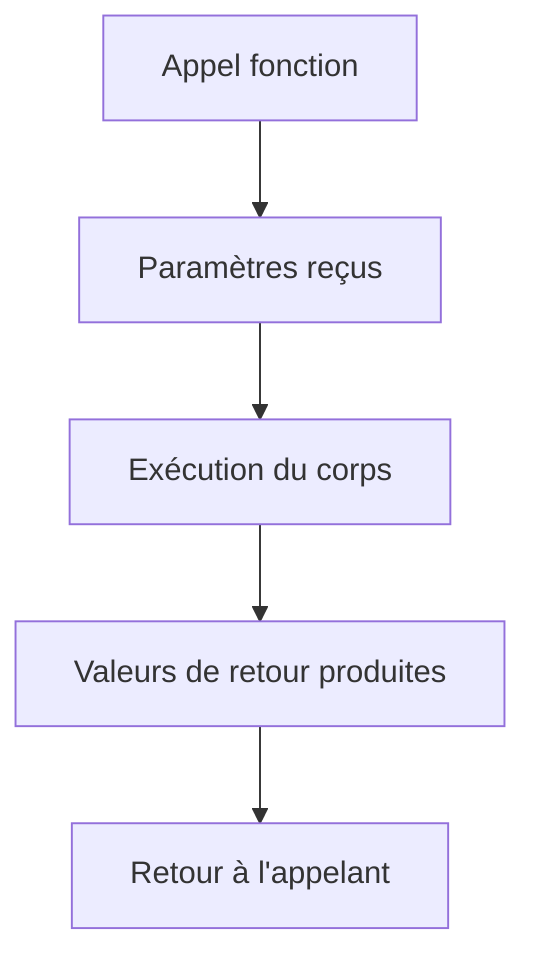

# 2- Collections, fonctions et erreurs  
## 2- Fonctions  
### 2- Paramètres et valeurs de retour  

---

## 1. Paramètres de fonction en Go  

### a) Syntaxe basique  

Les paramètres d’une fonction sont listés dans les parenthèses après le nom de la fonction, avec le nom et le type. Lorsque plusieurs paramètres consécutifs ont le même type, on peut factoriser le type.

```go
func addition(a, b int) int {
    return a + b
}
```

Ici, `a` et `b` sont deux paramètres de type `int`.

---

### b) Types de paramètres  

- Paramètres classiques (passage par valeur) : une copie de la valeur est transmise.  
- Passage par référence via pointeurs : on peut passer l’adresse pour modifier la valeur originale.

**Exemple passage par pointeur :**

```go
func incrementer(x *int) {
    *x = *x + 1
}

func main() {
    a := 5
    incrementer(&a)
    fmt.Println(a)  // affiche 6
}
```

---

### c) Paramètres variadiques  

Go permet de définir des fonctions avec un nombre variable de paramètres du même type, grâce à `...`.

```go
func somme(nums ...int) int {
    total := 0
    for _, n := range nums {
        total += n
    }
    return total
}

func main() {
    fmt.Println(somme(1, 2, 3))       // 6
    fmt.Println(somme(4, 5, 6, 7, 8)) // 30
}
```

---

## 2. Valeurs de retour  

### a) Retour simple  

Une fonction peut retourner une seule valeur. Le type de retour est indiqué après la parenthèse des paramètres.

```go
func carre(x int) int {
    return x * x
}
```

---

### b) Retour multiple  

Go autorise plusieurs valeurs de retour, souvent utilisées pour retourner une valeur et une erreur.

```go
func diviser(a, b float64) (float64, error) {
    if b == 0 {
        return 0, fmt.Errorf("division par zéro")
    }
    return a / b, nil
}

func main() {
    result, err := diviser(10, 2)
    if err != nil {
        fmt.Println("Erreur:", err)
    } else {
        fmt.Println("Résultat:", result)
    }
}
```

---

### c) Nommage des valeurs de retour  

On peut nommer les variables de retour dans la signature, ce qui permet d’utiliser un simple `return` sans spécifier les valeurs explicitement.

```go
func longueurEtPremier(s string) (longueur int, premier byte) {
    longueur = len(s)
    if longueur > 0 {
        premier = s[0]
    }
    return
}
```

---

## 3. Exemple complet intégrant paramètres variadiques, pointeurs et retour multiple  

```go
package main

import (
    "errors"
    "fmt"
)

func incrementer(x *int) {
    *x++
}

func somme(nums ...int) int {
    total := 0
    for _, n := range nums {
        total += n
    }
    return total
}

func diviser(a, b float64) (float64, error) {
    if b == 0 {
        return 0, errors.New("division par zéro")
    }
    return a / b, nil
}

func main() {
    var n int = 5
    incrementer(&n)
    fmt.Println("Après incrementer :", n) // 6

    fmt.Println("Somme :", somme(1, 2, 3, 4)) // 10

    div, err := diviser(10, 0)
    if err != nil {
        fmt.Println("Erreur :", err)
    } else {
        fmt.Println("Division :", div)
    }
}
```

---

## 4. Diagramme Mermaid – flux démontrant paramètres et résultats  



---

## 5. Points clés  

| Aspect                | Description                                      |
|-----------------------|------------------------------------------------|
| Paramètres            | Passage par valeur, par pointeur (adresse), ou variadiques |
| Retour                | Une ou plusieurs valeurs possibles              |
| Nommage des retours   | Permet retourner en `return` simple              |
| Paramètres variadiques| Syntaxe `...type`, accessibles comme slice     |

---

## Sources  

- Tour of Go, "Functions": https://go.dev/tour/basics/4  
- Documentation officielle Go, "Function declarations": https://golang.org/ref/spec#Function_declarations  
- Go by Example, "Functions": https://gobyexample.com/functions  
- Go by Example, "Variadic Functions": https://gobyexample.com/variadic-functions  
- Go Blog, "Error handling and multiple return values": https://blog.golang.org/error-handling-and-go  

---

Ce cours éclaire la variété des paramètres et retours dans Go, outils fondamentaux pour écrire des fonctions expressives, modulaires et sûres.