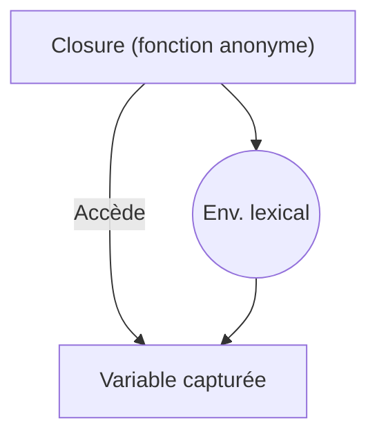

# 2- Collections, fonctions et erreurs  
## 2- Fonctions  
### 3- Fonctions anonymes et closures  

---

## 1. Fonctions anonymes  

Une fonction anonyme est une fonction définie sans nom et souvent directement assignée à une variable ou utilisée comme argument.

### Syntaxe  

```go
f := func(x int) int {
    return x * x
}
fmt.Println(f(5))  // Affiche 25
```

Cette fonction peut être immédiatement appelée, passée en argument ou retournée.

---

### Utilisations courantes  

- Passer des fonctions comme arguments (callbacks)  
- Création rapide de fonctions sans nom  
- Affectation à des variables pour être utilisées plus tard  

---

## 2. Closures en Go  

Une **closure** est une fonction anonyme qui **capture les variables** de son environnement lexical, c’est-à-dire qu’elle peut accéder et modifier les variables définies dans la portée englobante.

### Exemple simple :  

```go
func compteur() func() int {
    count := 0
    return func() int {
        count++
        return count
    }
}

func main() {
    c := compteur()
    fmt.Println(c())  // 1
    fmt.Println(c())  // 2
    fmt.Println(c())  // 3
}
```

**Explication** :  
La variable `count` est capturée par la fonction anonyme retournée et conserve son état entre les appels.

---

## 3. Comportement des closures avec variables itérées  

Il est courant d'avoir des pièges avec les closures capturant des variables dans une boucle.

### Piège classique :

```go
func main() {
    funcs := []func(){}
    for i := 0; i < 3; i++ {
        funcs = append(funcs, func() {
            fmt.Println(i)
        })
    }
    for _, f := range funcs {
        f()   // Affiche 3, 3, 3 et non 0,1,2
    }
}
```

### Solution correcte :

Capturer la variable `i` dans une variable locale :

```go
for i := 0; i < 3; i++ {
    i := i  // nouvelle variable locale
    funcs = append(funcs, func() {
        fmt.Println(i)
    })
}
```

---

## 4. Exemples d’usage pratiques  

### a) Fonction génératrice  

```go
func genererMultiplicateur(multiplicateur int) func(int) int {
    return func(x int) int {
        return x * multiplicateur
    }
}

func main() {
    doubler := genererMultiplicateur(2)
    tripler := genererMultiplicateur(3)
    fmt.Println(doubler(5)) // 10
    fmt.Println(tripler(5)) // 15
}
```

---

### b) Encapsulation d’état

Les closures permettent d’implémenter des structures similaires à des objets avec état.

---

## 5. Diagramme Mermaid — capture d’environnement d’une closure  



---

## 6. Résumé des concepts  

| Concept              | Description                                             |
|----------------------|---------------------------------------------------------|
| Fonction anonyme      | Fonction sans nom créée à la volée                       |
| Closure              | Fonction anonyme qui capture des variables de son scope |
| Capture de variable   | Conservation de l’état interne en mémoire                |
| Pièges                | Variables partagées dans les boucles                      |

---

## Sources  

- Documentation officielle Go sur fonctions : https://go.dev/ref/spec#Function_literals  
- Tour of Go, "Closures": https://go.dev/tour/moretypes/23  
- Go by Example, "Closures": https://gobyexample.com/closures  
- Effective Go, section sur fonctions : https://golang.org/doc/effective_go.html#function_literals  

---

Ce cours met en lumière comment Go propose des fonctions anonymes puissantes et des closures stockant de l’état, ce qui ouvre la porte à des techniques avancées de programmation fonctionnelle et modulaire.