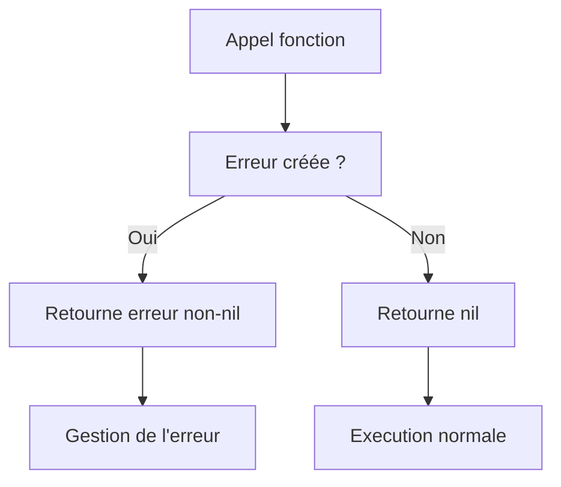

# 2- Collections, fonctions et erreurs  
## 3- Gestion des erreurs  
### 2- Utilisation de la fonction `error` intégrée  

---

## 1. Le type `error` et sa création en Go  

En Go, le type d'erreur est une interface prédéfinie dans le langage :

```go
type error interface {
    Error() string
}
```

Toute valeur implémentant cette interface peut être utilisée comme erreur.

Pour créer une erreur simple, on utilise souvent la fonction intégrée `errors.New` ou `fmt.Errorf`.

---

## 2. La fonction `errors.New`  

Définie dans le package `errors`, `errors.New` crée une erreur à partir d’une chaîne de caractères :

```go
import "errors"

err := errors.New("une erreur s'est produite")
fmt.Println(err.Error())  // affiche : une erreur s'est produite
```

C'est la méthode la plus simple et directe de créer une erreur.

---

## 3. La fonction `fmt.Errorf`  

Elle permet de formater une chaîne avant de la transformer en erreur, ce qui est utile pour inclure des valeurs dynamiques dans le message.

```go
import "fmt"

err := fmt.Errorf("erreur n°%d : %s", 404, "ressource non trouvée")
fmt.Println(err)  // affiche : erreur n°404 : ressource non trouvée
```

---

## 4. Exemple d'utilisation dans une fonction  

```go
package main

import (
    "errors"
    "fmt"
)

func ouvrirFichier(nom string) error {
    if nom == "" {
        return errors.New("nom de fichier vide")
    }
    // Ici, code pour ouvrir le fichier
    return nil // pas d’erreur
}

func main() {
    err := ouvrirFichier("")
    if err != nil {
        fmt.Println("Erreur:", err)
    } else {
        fmt.Println("Fichier ouvert avec succès.")
    }
}
```

---

## 5. Comparaison avec `nil`  

Une fonction retournant une erreur renvoie `nil` si aucune erreur ne survient.

```go
if err != nil {
    // gérer l’erreur
}
```

---

## 6. Diagramme Mermaid — gestion d’erreur classique  



---

## 7. Points clés  

| Fonction             | Description                                     | Package    |
|----------------------|-------------------------------------------------|------------|
| `errors.New(string)` | Crée une erreur simple avec message donné        | `errors`   |
| `fmt.Errorf`         | Crée une erreur avec message formaté             | `fmt`      |
| Valeur `nil`         | Indique absence d'erreur                          | Langage Go |

---

## Sources  

- Documentation officielle Go, package errors : https://pkg.go.dev/errors  
- Go by Example, "Errors" : https://gobyexample.com/errors  
- Tour of Go, "Errors" : https://go.dev/tour/moretypes/19  
- Effective Go, partie erreurs : https://golang.org/doc/effective_go#errors  

---

L'utilisation des fonctions intégrées `errors.New` et `fmt.Errorf` fournit une méthode simple et flexible pour générer et transmettre les erreurs en Go, assurant une communication claire des problèmes rencontrés dans l’exécution des fonctions.