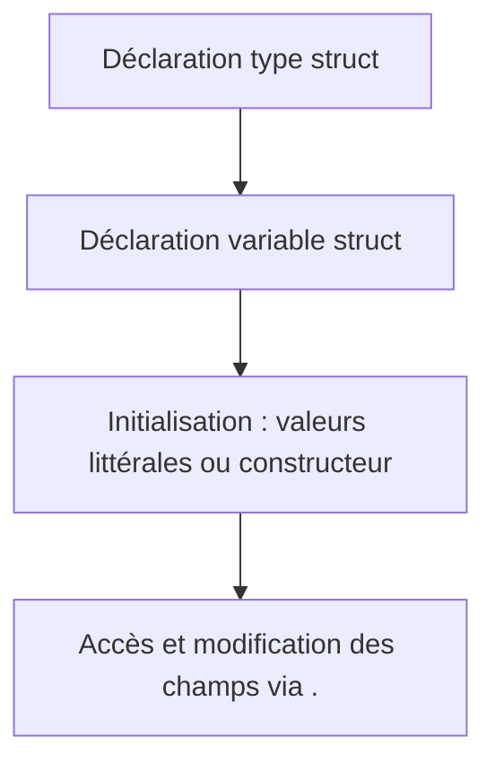

# 3- Structures, pointeurs et organisation du code  
## 1- Structures en Go  
### 1- Déclaration et initialisation des struct  

---

## 1. Définition d’une `struct`  

Une `struct` (structure) en Go est un type composite permettant de regrouper des champs nommés qui peuvent avoir différents types.

### Syntaxe basique  

```go
type Personne struct {
    Nom   string
    Age   int
    Email string
}
```

Ici, `Personne` est une structure avec trois champs : `Nom`, `Age`, et `Email`.

---

## 2. Initialisation d’une struct  

### a) Initialisation littérale avec tous les champs  

```go
p1 := Personne{
    Nom:   "Dupont",
    Age:   30,
    Email: "dupont@example.com",
}
```

Cette syntaxe claire nomme explicitement chaque champ.

### b) Initialisation littérale avec valeurs positionnelles (ordre des champs obligatoire)  

```go
p2 := Personne{"Martin", 25, "martin@example.com"}
```

Cette forme est plus concise mais moins claire et plus sensible à l’ordre des champs.

---

### c) Initialisation partielle  

On peut initialiser une struct en précisant seulement certains champs. Les champs non initialisés valent la **valeur zéro** de leur type (0, "", nil, etc.) :

```go
p3 := Personne{
    Nom: "Leclerc",
}
fmt.Println(p3.Age)  // affiche 0
```

---

### d) Initialisation avec le constructeur personnalisé  

Il est courant d’écrire une fonction constructeur pour initialiser une struct, ce qui permet d'encapsuler la logique d'initialisation.

```go
func NouvellePersonne(nom string, age int) *Personne {
    return &Personne{
        Nom: nom,
        Age: age,
    }
}

p4 := NouvellePersonne("Dupuis", 40)
```

---

## 3. Modifications et accès aux champs  

Avec une variable de type struct, on accède et modifie les champs via le point (`.`) :

```go
p := Personne{}
p.Nom = "Lemoine"
p.Age = 28
fmt.Println(p.Nom)  // Affiche: Lemoine
```

---

## 4. Exemple complet  

```go
package main

import "fmt"

type Personne struct {
    Nom   string
    Age   int
    Email string
}

func NouvellePersonne(nom string, age int) *Personne {
    return &Personne{
        Nom: nom,
        Age: age,
    }
}

func main() {
    p1 := Personne{"Durand", 45, "durand@example.com"}
    fmt.Println(p1)

    p2 := Personne{Nom: "Moreau"}
    fmt.Println(p2)

    p3 := NouvellePersonne("Bernard", 32)
    fmt.Println(p3)
}
```

---

## 5. Diagramme Mermaid — cycle de vie d’une struct 



---

## 6. Points clés  

| Élément               | Description                             |
|-----------------------|---------------------------------------|
| `type` + `struct`     | Crée un nouveau type structuré        |
| Champs nommés         | Champs avec noms et types spécifiques  |
| Initialisation        | Littérale (nommée ou positionnelle)    |
| Valeur zéro            | Champs non initialisés ont valeur zéro |
| Pointeurs à struct     | Usages fréquents pour références       |

---

## Sources  

- Documentation officielle Go, https://go.dev/doc/effective_go#structs  
- Tour of Go, "Structs": https://go.dev/tour/moretypes/5  
- Go by Example, "Structs": https://gobyexample.com/structs  

---

Ce cours présente la syntaxe et les bonnes pratiques pour définir et initialiser des struct en Go, permettant de modéliser facilement des objets complexes avec plusieurs champs hétérogènes.