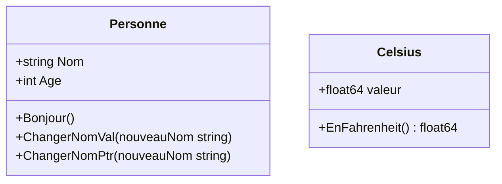

# 3- Structures, pointeurs et organisation du code  
## 1- Structures en Go  
### 2- Méthodes associées  

---

## 1. Introduction aux méthodes en Go  

En Go, les **méthodes** sont des fonctions associées à un type particulier, souvent une `struct`. Elles permettent d’attacher un comportement aux données, comme en programmation orientée objet, mais sans classes.

---

## 2. Déclaration d’une méthode  

Une méthode est déclarée avec un **récepteur** `(r Type)` avant le nom de la fonction :

```go
func (p Personne) Bonjour() string {
    return "Bonjour, je m'appelle " + p.Nom
}
```

Ici, la méthode `Bonjour` appartient au type `Personne` et peut accéder à ses champs.

---

## 3. Récepteur valeur vs pointeur  

### Récepteur valeur  

```go
func (p Personne) ChangerNomVal(nom string) {
    p.Nom = nom
}
```

Cette méthode reçoit une copie de la struct : les modifications ne seront pas visibles en dehors de la méthode.

### Récepteur pointeur  

```go
func (p *Personne) ChangerNomPtr(nom string) {
    p.Nom = nom
}
```

Cette méthode reçoit un pointeur vers la struct : les modifications affecteront bien la variable d’origine.

---

### Exemple complet  

```go
package main

import "fmt"

type Personne struct {
    Nom string
    Age int
}

func (p Personne) Bonjour() {
    fmt.Println("Bonjour, je suis", p.Nom)
}

func (p Personne) ChangerNomVal(nouveauNom string) {
    p.Nom = nouveauNom
}

func (p *Personne) ChangerNomPtr(nouveauNom string) {
    p.Nom = nouveauNom
}

func main() {
    p := Personne{Nom: "Alice", Age: 30}
    p.Bonjour() // Bonjour, je suis Alice

    p.ChangerNomVal("Bob")
    p.Bonjour() // Toujours Alice (pas changé)

    p.ChangerNomPtr("Charlie")
    p.Bonjour() // Charlie (modification effective)
}
```

---

## 4. Appel automatique de méthode via pointeur ou valeur  

Go permet d'appeler des méthodes à partir de valeurs ou pointeurs sans conversion explicite :

```go
p := Personne{"Alice", 30}
p.ChangerNomPtr("Bob")  // Go fait automatiquement l'adresse &p

pPtr := &p
pPtr.Bonjour()          // Go fait automatiquement la déférencement *pPtr
```

---

## 5. Méthodes pour les types autres que struct  

Les méthodes peuvent être définies pour tout type nommé (même alias).  

```go
type Celsius float64

func (c Celsius) EnFahrenheit() float64 {
    return float64(c)*1.8 + 32
}
```

---

## 6. Diagramme Mermaid — résumé structure des méthodes  



---

## 7. Points clés  

| Élément                | Description                                   |
|------------------------|-----------------------------------------------|
| Méthode                | Fonction avec récepteur attaché                |
| Récepteur valeur       | Copie de la struct, modification locale seule|
| Récepteur pointeur    | Permet modification sur l’instance originale   |
| Appel simplifié       | Go convertit automatiquement entre valeur et pointeur |
| Méthodes sur types     | Utilisable pour `struct` et autres types nommés|

---

## Sources  

- Documentation officielle Go, "Methods": https://go.dev/doc/effective_go#methods  
- Tour of Go, "Methods": https://go.dev/tour/moretypes/17  
- Go by Example, "Methods": https://gobyexample.com/methods  

---

Ce cours explicite comment définir et exploiter les méthodes en Go, en distinguant les récepteurs par valeur ou pointeur, pour implémenter des comportements proches de la programmation objet tout en respectant la simplicité du langage.