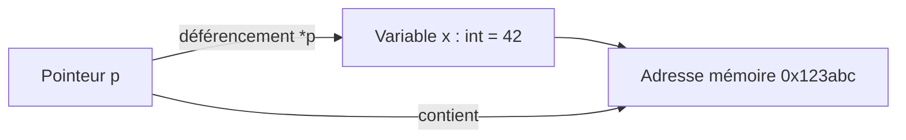

# 3- Structures, pointeurs et organisation du code  
## 2- Pointeurs  
### 1- Concept et syntaxe des pointeurs  

---

## 1. Que sont les pointeurs en Go ?  

Un **pointeur** est une variable qui stocke l'adresse mémoire d’une autre variable. Ils permettent d’accéder et modifier directement la valeur stockée à cette adresse, plutôt que de travailler sur une copie.  

Cela est utile pour :  
- Passer des références aux fonctions (gain de performance, modifications directes)  
- Manipuler dynamiquement des structures de données complexes  
- Implémenter des méthodes avec récepteurs pointeurs  

---

## 2. Syntaxe de base  

### a) Déclaration d'un pointeur  

```go
var p *int
```

`p` est un pointeur vers un `int`. Par défaut, sa valeur est `nil` (aucune adresse valide).

### b) Adresse d’une variable avec `&`  

Pour récupérer l'adresse d'une variable, on utilise l'opérateur `&` :

```go
x := 42
p = &x  // p pointe vers x
```

### c) Déférencement avec `*`  

Pour accéder à la valeur pointée par un pointeur, on utilise l’opérateur `*` :

```go
fmt.Println(*p) // affiche 42
```

On peut aussi modifier directement la valeur référencée :

```go
*p = 100
fmt.Println(x)  // affiche 100
```

---

## 3. Exemples illustratifs  

```go
package main

import "fmt"

func changerValeur(p *int) {
    *p = 10
}

func main() {
    var a int = 5
    fmt.Println("Avant :", a) // Avant : 5

    changerValeur(&a)

    fmt.Println("Après :", a)  // Après : 10
}
```

Dans cet exemple, la variable `a` est modifiée via un pointeur passé à la fonction.

---

## 4. Utilité des pointeurs dans les structures  

Les pointeurs permettent d’éviter la copie complète de structures souvent volumineuses, et de modifier directement l’instance d’une struct.

```go
type Personne struct {
    Nom string
    Age int
}

func vieillir(p *Personne) {
    p.Age += 1
}

func main() {
    p := Personne{Nom: "Luc", Age: 30}
    vieillir(&p)
    fmt.Println(p.Age)  // 31
}
```

---

## 5. Diagramme Mermaid — relation variable et pointeur  



---

## 6. Synthèse des opérateurs  

| Opérateur | Usage                        | Exemple              |
|-----------|------------------------------|----------------------|
| `&`       | Adresse d’une variable       | `p := &x`            |
| `*`       | Déférencement (valeur pointée) | `fmt.Println(*p)`    |

---

## 7. Attention aux pointeurs nuls  

Un pointeur non initialisé vaut `nil`. Déférencer un pointeur `nil` provoque un panic. Toujours vérifier avant d’accéder :

```go
var p *int = nil
if p != nil {
    fmt.Println(*p)
} else {
    fmt.Println("p est nil")
}
```

---

## Sources  

- Documentation officielle Go, Pointeurs: https://go.dev/doc/effective_go#pointers  
- Tour of Go, "Pointers": https://go.dev/tour/moretypes/6  
- Go by Example, "Pointers": https://gobyexample.com/pointers  

---

Ce cours introduit les pointeurs en Go avec leur syntaxe et exemples d’usage, permettant une gestion fine et performante des données et facilitant la manipulation d’objets complexes.