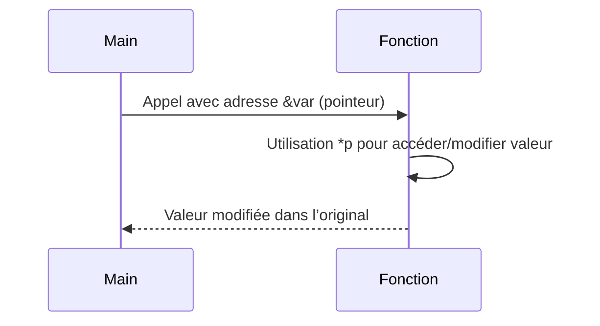

# 3- Structures, pointeurs et organisation du code  
## 2- Pointeurs  
### 2- Passage par référence  

---

## 1. Passage par valeur vs passage par référence  

En Go, les arguments des fonctions sont **passés par valeur** : la fonction reçoit une copie de la variable.  

Cela signifie qu’une modification dans la fonction ne modifie pas l’original :  

```go
func incrementer(x int) {
    x = x + 1
}

a := 5
incrementer(a)
fmt.Println(a) // affiche 5, pas 6
```

Pour modifier la valeur d’origine, il faut passer **par référence** avec un pointeur.

---

## 2. Passage par référence avec pointeur  

Au lieu de passer une copie, on passe l’adresse mémoire de la variable avec l’opérateur `&` :

```go
func incrementerPtr(x *int) {
    *x = *x + 1
}

a := 5
incrementerPtr(&a)
fmt.Println(a) // affiche 6
```

- La fonction reçoit un pointeur vers l’entier.  
- Le déférencement `*x` permet d’accéder à la valeur réelle et la modifier.

---

## 3. Avantages du passage par référence  

- **Permet la modification de la variable d’origine** même dans une fonction.  
- **Évite des copies coûteuses** de grandes structures ou tableaux.  
- Utilisé fréquemment avec des structs ou objets plus volumineux.  

---

## 4. Exemples avec les structs  

```go
type Point struct {
    X, Y int
}

func deplacer(p *Point, dx, dy int) {
    p.X += dx
    p.Y += dy
}

func main() {
    pt := Point{X: 1, Y: 2}
    deplacer(&pt, 3, 4)
    fmt.Println(pt) // {4 6}
}
```

---

## 5. Passage par valeur d’une struct vs passage par pointeur  

### Passage par valeur  

```go
func changerX(p Point) {
    p.X = 100
}

pt := Point{10, 20}
changerX(pt)
fmt.Println(pt.X) // 10, la modification locale n’a pas affecté pt
```

### Passage par pointeur  

```go
func changerXPointeur(p *Point) {
    p.X = 100
}

changerXPointeur(&pt)
fmt.Println(pt.X) // 100, modification effective
```

---

## 6. Diagramme Mermaid — schéma du passage par référence  



---

## 7. Attention au passage par référence  

- Le pointeur doit être valide (non nil) pour éviter panic.  
- La manipulation de pointeurs doit rester claire pour ne pas compliquer la lecture du code.  

---

## Sources  

- Documentation officielle Go, paramétrage et pointeurs : https://go.dev/doc/effective_go#passing  
- Tour of Go, "Pointers": https://go.dev/tour/moretypes/6  
- Go by Example, "Pointers": https://gobyexample.com/pointers  

---

Ce cours présente le concept fondamental du passage par référence via pointeurs en Go, permettant la modification directe des variables passées en argument et optimisant la manipulation des données volumineuses.