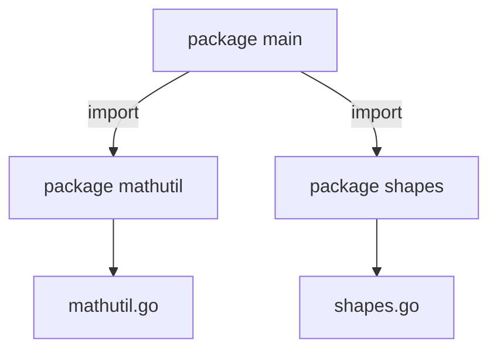

# 3- Structures, pointeurs et organisation du code  
## 3- Organisation du code  
### 1- Création et utilisation des packages  

---

## 1. Qu’est-ce qu’un package en Go ?  

Un **package** est une unité de compilation et d’organisation du code source en Go. Il regroupe un ensemble de fichiers `.go` qui partagent un même espace de noms.  

Chaque fichier source commence par la déclaration du package auquel il appartient :

```go
package monpackage
```

Le package central de l’exécutable est toujours `package main`.

---

## 2. Structure d’un package  

Un package peut contenir :  
- des fonctions  
- des types (structs, interfaces)  
- des variables et constantes  
- des méthodes associées  

Seuls les identifiants **exportés** (commençant par une majuscule) sont accessibles depuis l’extérieur du package.

---

## 3. Création d’un package  

Imaginons un package `mathutil` contenant une fonction pour calculer le carré d’un nombre.

Arborescence :

```
/monprojet
  /mathutil
    mathutil.go
  main.go
```

`mathutil/mathutil.go` :

```go
package mathutil

func Square(x int) int {
    return x * x
}
```

---

## 4. Utilisation d’un package  

Dans le `main.go` du projet :

```go
package main

import (
    "fmt"
    "monprojet/mathutil"
)

func main() {
    fmt.Println(mathutil.Square(5)) // Affiche 25
}
```

Le package est importé avec `import "monprojet/mathutil"`.  

L’identifiant `Square` est accessible car il commence par une majuscule.

---

## 5. Organisation des packages dans le workspace  

- Chaque package est un répertoire distinct.  
- Le nom des packages correspond généralement au nom du répertoire.  
- Le point d'entrée `package main` contient la fonction `main()`.  
- Pour les projets plus complexes, les packages sont organisés en sous-répertoires.  

---

## 6. Packages standards vs packages utilisateurs  

Go fournit une bibliothèque standard riche accessible via l’import. Exemples :  

```go
import (
    "fmt"
    "net/http"
    "encoding/json"
)
```

Les packages utilisateurs peuvent également être importés via des modules Go (via `go.mod`) en précisant leur chemin complet.

---

## 7. Exemples complémentaires  

### Export et méthode dans un package

```go
package shapes

type Rectangle struct {
    Width, Height int
}

func (r Rectangle) Area() int {
    return r.Width * r.Height
}
```

Utilisation dans un autre package :

```go
package main

import (
    "fmt"
    "monprojet/shapes"
)

func main() {
    r := shapes.Rectangle{Width: 5, Height: 3}
    fmt.Println(r.Area())  // 15
}
```

---

## 8. Diagramme Mermaid — organisation basique des packages  



---

## 9. Points clés  

| Élément                  | Description                                   |
|--------------------------|-----------------------------------------------|
| `package`                | Directive obligatoire en tête du fichier      |
| Visibilité/exportation   | Identifiants avec majuscule accessibles partout |
| Structure               | Un package = un répertoire                     |
| Importation             | `import "chemin/du/package"`                    |
| Packages standard & tiers| Disponibles via import et modules Go           |

---

## Sources  

- Documentation officielle Go, Packages : https://go.dev/doc/code  
- Effective Go, packages : https://golang.org/doc/effective_go#package-names  
- Go by Example, Packages : https://gobyexample.com/packages

---

Ce cours explique comment créer, structurer et utiliser les packages en Go, garantissant un code modulaire, lisible et facile à maintenir dans des projets de toute taille.