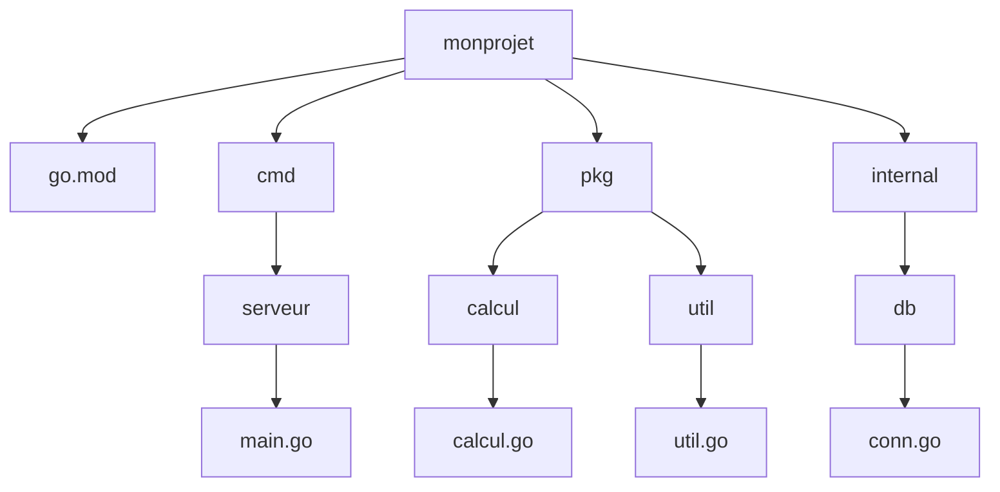

# 3- Structures, pointeurs et organisation du code  
## 3- Organisation du code  
### 2- Structure d’un projet Go  

---

## 1. Introduction à la structure d’un projet Go  

Un projet Go est organisé selon une convention simple et standardisée qui facilite la maintenance, la lisibilité et le déploiement.  

Depuis l’introduction des modules Go (`go mod`), la gestion des dépendances et la structure sont devenues plus flexibles tout en respectant des bonnes pratiques.

---

## 2. Composants principaux d’un projet Go  

### a) Le fichier `go.mod`  

- Définit le **module** (le nom du projet ou chemin d’import).  
- Gère les dépendances et versions via Go Modules.  
- Extrait type d’un fichier `go.mod` :

```mod
module github.com/monuser/monprojet

go 1.20

require (
    github.com/some/dependency v1.2.3
)
```

---

### b) Le dossier `cmd/`  

Contient les **applications principales** (binaries). Chaque sous-dossier représente une application avec un `main.go`:  

```
cmd/
  app1/
    main.go
  app2/
    main.go
```

Permet d’avoir plusieurs commandes dans un même repository.

---

### c) Les packages métiers dans des dossiers propres  

Exemple :  

```
pkg/
  service/
  dao/
  utils/
```

Contient le code réutilisable, organisé en fonction des domaines fonctionnels.

---

### d) Dossier `internal/`  

Les packages dans `internal/` sont **accessibles uniquement au sein du repo** (c’est une restriction imposée par le compilateur).  

Permet de protéger du code non destiné à être utilisé en dehors du projet :

```
internal/
  authentication/
  cache/
```

---

### e) Dossier `api/` (optionnel)  

Contient contrats API, fichiers swagger, protobuf, etc.

---

## 3. Exemple minimal de structure d’un projet  

```
monprojet/
├── go.mod
├── cmd/
│   └── serveur/
│       └── main.go
├── pkg/
│   ├── calcul/
│   │    └── calcul.go
│   └── util/
│        └── util.go
└── internal/
    └── db/
        └── conn.go
```

---

## 4. Exemple concret de `go.mod`  

```mod
module github.com/monuser/monprojet

go 1.20

require github.com/stretchr/testify v1.8.2
```

---

## 5. Usage typique de fichiers  

- `cmd/serveur/main.go` : point d’entrée, initialise le serveur.  
- `pkg/calcul/calcul.go` : fonctions métier (ex : calculs).  
- `internal/db/conn.go` : gestion base de données, code non exposé hors module.

---

## 6. Diagramme Mermaid — structure typique d’un projet Go  



---

## 7. Bonnes pratiques  

| Élément                 | Recommandation                                   |
|-------------------------|------------------------------------------------|
| Modules                 | Toujours initialiser avec `go mod init`         |
| Dossier `cmd/`          | Contient tous les points d’entrée                |
| Dossier `pkg/`          | Fonctionnalités exportables et réutilisables     |
| Dossier `internal/`     | Code privé au module, éviter les fuites d’abstraction |
| Nommage                 | Garder noms courts, parlants, cohérents           |

---

## Sources  

- Documentation officielle Go : https://go.dev/doc/modules  
- Guide Go Project Layout : https://github.com/golang-standards/project-layout  
- Blog Go : Organizing Go Programs https://go.dev/doc/code#Organization  

---

Ce cours synthétise la structure standard recommandée pour les projets Go modernes, favorisant la modularité, la maintenance et la clarté dans le développement et la collaboration.