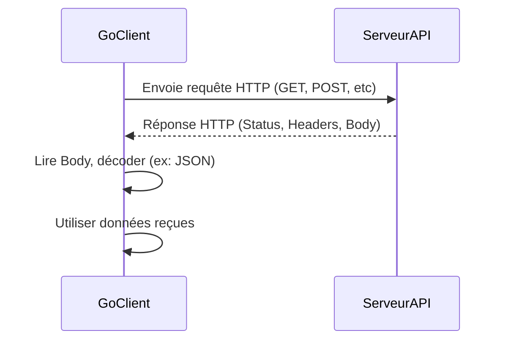

# 4- Go et le Web : Consommation d’API  
## 1- Requêtes HTTP  
### 1- Utilisation du package net/http

---

## 1. Introduction au package `net/http`  

Le package `net/http` est la bibliothèque standard de Go pour gérer les protocoles HTTP. Il prend en charge à la fois la création de serveurs HTTP et la réalisation de requêtes clients, permettant de consommer des API web facilement.  

Pour la consommation d'API (clients HTTP), on utilise principalement les types `http.Client` et les fonctions simplifiées comme `http.Get` et `http.Post`.  

---

## 2. Effectuer une requête GET simple  

La fonction `http.Get` permet d’envoyer une requête GET vers une URL et récupérer la réponse.

```go
resp, err := http.Get("https://api.example.com/data")
if err != nil {
    log.Fatal(err)
}
defer resp.Body.Close()

body, err := io.ReadAll(resp.Body)
if err != nil {
    log.Fatal(err)
}

fmt.Println(string(body))
```

- `resp.Body` est un `io.ReadCloser` qu’il faut toujours fermer pour libérer les ressources.  
- Le corps de la réponse est lu avec `io.ReadAll`.  

---

## 3. Exemple complet : récupération et décodage JSON  

Le plus souvent, les API renvoient du JSON qu’il faut parser avec `encoding/json`.

```go
package main

import (
    "encoding/json"
    "fmt"
    "log"
    "net/http"
    "io"
)

type User struct {
    ID   int    `json:"id"`
    Name string `json:"name"`
}

func main() {
    resp, err := http.Get("https://jsonplaceholder.typicode.com/users/1")
    if err != nil {
        log.Fatal(err)
    }
    defer resp.Body.Close()

    if resp.StatusCode != http.StatusOK {
        log.Fatalf("Status : %s", resp.Status)
    }

    body, err := io.ReadAll(resp.Body)
    if err != nil {
        log.Fatal(err)
    }

    var user User
    if err := json.Unmarshal(body, &user); err != nil {
        log.Fatal(err)
    }

    fmt.Printf("User: %+v\n", user)
}
```

---

## 4. Utilisation de `http.Client` et requêtes personnalisées  

Pour plus de contrôle (méthode, headers, timeout), il est préférable d’utiliser `http.Client` et `http.NewRequest`.

```go
client := &http.Client{}

req, err := http.NewRequest("GET", "https://api.example.com/data", nil)
if err != nil {
    log.Fatal(err)
}

req.Header.Set("Authorization", "Bearer mon_token")

resp, err := client.Do(req)
if err != nil {
    log.Fatal(err)
}
defer resp.Body.Close()

// traitement de la réponse
```

---

## 5. Envoi d’une requête POST avec un corps JSON  

```go
import (
    "bytes"
    "encoding/json"
)

type Payload struct {
    Name string `json:"name"`
    Age  int    `json:"age"`
}

data := Payload{Name: "Alice", Age: 30}
jsonData, err := json.Marshal(data)
if err != nil {
    log.Fatal(err)
}

resp, err := http.Post("https://api.example.com/users", "application/json", bytes.NewBuffer(jsonData))
if err != nil {
    log.Fatal(err)
}
defer resp.Body.Close()

fmt.Println("Status :", resp.Status)
```

---

## 6. Gestion des erreurs et codes HTTP  

- Toujours vérifier `err`.  
- Vérifier la valeur de `resp.StatusCode` (200-299 signifie succès).  
- Gérer proprement la fermeture de `resp.Body` avec `defer`.  

---

## 7. Diagramme Mermaid — Flux de requête HTTP client  



---

## 8. Points clés  

| Élément                | Description                              |
|------------------------|------------------------------------------|
| `http.Get`             | Requête GET simple                       |
| `http.Post`            | Requête POST rapide avec corps            |
| `http.Client` + `NewRequest` | Requêtes personnalisées (headers, méthodes, timeout) |
| `resp.Body`            | Corps de la réponse, doit être fermé     |
| `json.Unmarshal`       | Décodage JSON                            |

---

## Sources  

- Documentation `net/http` officielle : https://pkg.go.dev/net/http  
- Go by Example, HTTP Clients : https://gobyexample.com/http-requests  
- Tour of Go, "HTTP Servers" (pour comprendre aussi côté serveur) : https://go.dev/tour/http/  

---

Ce cours détaille l’usage du package standard `net/http` pour faire des requêtes HTTP en Go, illustré par des exemples concrets de GET, POST, gestion des en-têtes, et décodage JSON, base essentielle pour consommer les API web.