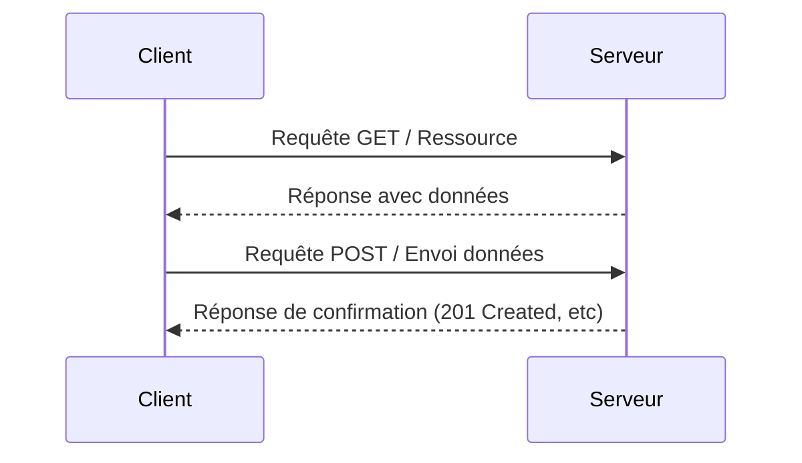

# 4- Go et le Web : Consommation d’API  
## 1- Requêtes HTTP  
### 2- Faire une requête GET et POST  

---

## 1. Requête HTTP GET en Go  

La requête GET sert à **récupérer des ressources** depuis un serveur (ex: données JSON, fichiers).  

La méthode la plus simple pour envoyer une requête GET en Go est d’utiliser :  

```go
resp, err := http.Get(url)
```

### Exemple simple

```go
package main

import (
    "fmt"
    "io"
    "log"
    "net/http"
)

func main() {
    url := "https://jsonplaceholder.typicode.com/posts/1"
    
    resp, err := http.Get(url)
    if err != nil {
        log.Fatal(err)
    }
    defer resp.Body.Close()

    if resp.StatusCode != http.StatusOK {
        log.Fatalf("Erreur : status code %d", resp.StatusCode)
    }

    body, err := io.ReadAll(resp.Body)
    if err != nil {
        log.Fatal(err)
    }

    fmt.Println(string(body))
}
```

Ici, on récupère un post JSON depuis une API test.

---

## 2. Requête HTTP POST en Go  

La requête POST sert à **envoyer des données** au serveur, par exemple pour créer une ressource.  

On utilise souvent `http.Post` ou la méthode générique avec `http.Client` et `http.NewRequest`.

### Exemple avec `http.Post` et données JSON

```go
package main

import (
    "bytes"
    "encoding/json"
    "fmt"
    "log"
    "net/http"
)

func main() {
    url := "https://jsonplaceholder.typicode.com/posts"

    // Structure des données à envoyer
    postData := map[string]interface{}{
        "title":  "foo",
        "body":   "bar",
        "userId": 1,
    }

    jsonValue, err := json.Marshal(postData)
    if err != nil {
        log.Fatal(err)
    }

    resp, err := http.Post(url, "application/json", bytes.NewBuffer(jsonValue))
    if err != nil {
        log.Fatal(err)
    }
    defer resp.Body.Close()

    fmt.Println("Status code:", resp.StatusCode)
}
```

### Passage de headers personnalisés avec `http.Client`

Pour plus de contrôle, on peut créer une requête POST manuellement : 

```go
client := &http.Client{}

req, err := http.NewRequest("POST", url, bytes.NewBuffer(jsonValue))
if err != nil {
    log.Fatal(err)
}

req.Header.Set("Content-Type", "application/json")
req.Header.Set("Authorization", "Bearer mytoken")

resp, err := client.Do(req)
if err != nil {
    log.Fatal(err)
}
defer resp.Body.Close()
```

---

## 3. Différences clés entre GET et POST

| Critère           | GET                                    | POST                              |
|-------------------|----------------------------------------|----------------------------------|
| Usage             | Récupération de données                 | Envoi/modification de données     |
| Corps de requête  | Généralement vide                       | Contient les données à transmettre|
| Idempotence       | Oui (répété, même effet)                | Non nécessairement idempotente    |
| Sécurité          | Paramètres dans URL (limites de taille)| Données dans corps (plus sûr)     |

---

## 4. Diagramme Mermaid — flux d’une requête HTTP  



---

## 5. Conseils pratiques  

- Toujours **fermer le corps de réponse** avec `defer resp.Body.Close()` pour éviter les fuites mémoire.  
- Vérifier le **code HTTP** (status) avant de traiter la réponse.  
- Pour POST, s’assurer d’encoder proprement les données (souvent en JSON).  
- Pour des headers spécifiques ou méthodes HTTP non standard, utiliser `http.NewRequest`.  

---

## Sources  

- Documentation `net/http` : https://pkg.go.dev/net/http  
- Go by Example – HTTP clients : https://gobyexample.com/http-requests  
- JSON Placeholder (API test simple) : https://jsonplaceholder.typicode.com/  

---

Ce cours montre comment effectuer des requêtes HTTP GET et POST en Go, avec exemples pour récupérer et envoyer des données JSON, ainsi que les bonnes pratiques d’usage du package standard `net/http`.