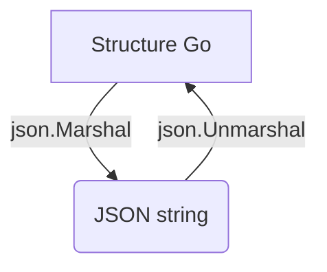

# 4- Go et le Web : Consommation d’API  
## 2- Traitement JSON  
### 1- Marshalling et Unmarshalling JSON  

---

## 1. Introduction au JSON et Go  

JSON (JavaScript Object Notation) est un format de données texte léger, très utilisé pour l’échange d’informations entre client et serveur (API).  

Go offre un support natif pour la conversion entre structures Go et JSON via le package `encoding/json`.  

---

## 2. Concepts clés  

| Terme           | Description                              |
|-----------------|------------------------------------------|
| **Marshalling**   | Conversion d’une structure Go en JSON (serialization) |
| **Unmarshalling** | Conversion de JSON en structure Go (désérialisation) |

---

## 3. Marshalling : passer d’une structure Go vers JSON  

Utilisation de `json.Marshal` qui retourne un slice d’octets contenant le JSON encodé.

```go
package main

import (
    "encoding/json"
    "fmt"
    "log"
)

type User struct {
    ID    int    `json:"id"`
    Name  string `json:"name"`
    Email string `json:"email,omitempty"` // omit empty champ si vide
}

func main() {
    user := User{ID: 1, Name: "Alice"}

    jsonData, err := json.Marshal(user)
    if err != nil {
        log.Fatal(err)
    }

    fmt.Println(string(jsonData)) // {"id":1,"name":"Alice"}
}
```

- Les tags struct (ex: `json:"id"`) permettent d’indiquer le nom dans JSON.  
- Avec `omitempty`, un champ vide est omis du JSON généré.  

---

## 4. Unmarshalling : décoder un JSON en structure Go  

Utilisation de `json.Unmarshal` qui décode un slice d’octets JSON dans une instance Go.

```go
package main

import (
    "encoding/json"
    "fmt"
    "log"
)

type User struct {
    ID    int    `json:"id"`
    Name  string `json:"name"`
    Email string `json:"email"`
}

func main() {
    jsonStr := `{"id":42,"name":"Bob","email":"bob@example.com"}`

    var user User
    if err := json.Unmarshal([]byte(jsonStr), &user); err != nil {
        log.Fatal(err)
    }

    fmt.Printf("User : %+v\n", user)
}
```

- Il est nécessaire de passer un **pointeur** à `Unmarshal` pour modifier la variable.  
- Les champs JSON doivent correspondre aux tags ou noms dans la struct.  

---

## 5. Utilisation avec des types génériques  

On peut décomposer des JSON plus complexes en utilisant des maps ou des slices :  

```go
var data map[string]interface{}
jsonStr := `{"name":"Eve","age":29,"skills":["Go","Python"]}`

if err := json.Unmarshal([]byte(jsonStr), &data); err != nil {
    log.Fatal(err)
}

fmt.Println(data["skills"]) // [Go Python]
```

---

## 6. Gestion des erreurs  

Le marshal ou unmarshal peut échouer si le JSON est mal formé ou non conforme à la structure attendue. Il faut toujours traiter l’erreur :

```go
err := json.Unmarshal([]byte(badJSON), &var)
if err != nil {
    // gestion erreur
}
```

---

## 7. Diagramme Mermaid — cycle marshalling / unmarshalling  



---

## 8. Points importants  

| Aspect                  | Détail                                         |
|-------------------------|------------------------------------------------|
| Tags JSON               | Contrôle la représentation JSON                |
| Pointeurs pour Unmarshal| Nécessaires pour modifier les variables         |
| Types compatibles       | Structures, maps, slices, primitives             |
| `omitempty`             | Omets les champs vides lors du marshallage      |

---

## 9. Sources  

- Documentation officielle `encoding/json` : https://pkg.go.dev/encoding/json  
- Go by Example, JSON : https://gobyexample.com/json  
- Tour of Go, JSON : https://go.dev/tour/moretypes/23  

---

Ce cours présente les mécanismes fondamentaux du traitement JSON en Go, avec les opérations de marshalling et unmarshalling, illustrées par des exemples simples et orientés pratique.