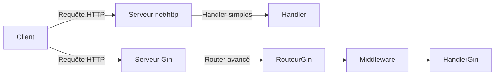

# 5- Développement d’API REST avec Go  
## 1- Frameworks web en Go  
### 1- Introduction à `net/http` et aux frameworks légers comme Gin  

---

## 1. Le package standard `net/http`  

Go dispose d’un support natif HTTP complet avec le package `net/http`.  

### Fonctionnalités principales :  
- Création d’un serveur HTTP simple  
- Gestion des routes via `http.HandleFunc`  
- Lecture et écriture sécurisée des requêtes/réponses  
- Support des middlewares via `http.Handler` et `http.HandlerFunc`  

### Exemple minimal : serveur HTTP

```go
package main

import (
    "fmt"
    "net/http"
)

func helloHandler(w http.ResponseWriter, r *http.Request) {
    fmt.Fprintf(w, "Bonjour, monde !")
}

func main() {
    http.HandleFunc("/", helloHandler)
    http.ListenAndServe(":8080", nil)
}
```

### Avantages :  
- Inclus dans la bibliothèque standard  
- Très léger, sans dépendances externes  
- Contrôle précis du flux HTTP  

### Limites :  
- Gestion manuelle des routes (pas de routeurs avancés)  
- Pas d’outils intégrés pour les middlewares complexes, validation, parsing JSON, etc.  

---

## 2. Frameworks légers : Gin  

Gin est un framework HTTP web léger, performant et très populaire. Il s’appuie sur `net/http` mais simplifie le développement par :  
- Un routeur performant avec groupes de routes  
- Gestion simplifiée des middlewares  
- Liée JSON automatique (binding et rendu)  
- Gestion d’erreurs homogène  
- Context simplifié dans les handlers  

### Exemple simple avec Gin

```go
package main

import (
    "github.com/gin-gonic/gin"
)

func main() {
    r := gin.Default() // inclut logger et recovery middleware

    r.GET("/ping", func(c *gin.Context) {
        c.JSON(200, gin.H{"message": "pong"})
    })

    r.Run(":8080")
}
```

### Fonctionnalités supplémentaires :  
- Validation des données d’entrée  
- Groupes de routes / versioning  
- Support intégré pour WebSocket, templates HTML  
- Middleware personnalisés très faciles à implémenter  

---

## 3. Comparaison synthétique  

| Critère             | net/http                          | Gin                                      |
|---------------------|----------------------------------|------------------------------------------|
| Complexité          | Simple mais bas niveau            | Simple d’usage, plus abstrait            |
| Performance         | Très élevée                      | Très élevée (basée sur httprouter)       |
| Gestion routes      | Basique (HandleFunc)              | Routeur puissant avec groupes            |
| Middleware          | Manuel (interfaces)              | Intégré et facile à utiliser              |
| JSON (binding)      | Manuel (encoding/json)            | Automatique et centralisé                 |
| Communauté          | Large (standard Go)               | Active, écosystème riche                  |

---

## 4. Diagramme Mermaid — architecture simplifiée  



---

## 5. Résumé des bonnes pratiques  

- Pour un petit service ou un besoin très précis, `net/http` est largement suffisant et offre un contrôle complet.  
- Pour développer rapidement une API REST avec gestion simplifiée des requêtes, middlewares, et validations, Gin est une option légère et performante.  
- Toujours gérer les erreurs HTTP et les middlewares pour logging, authentification, gestion des CORS.  

---

## 6. Sources  

- Documentation officielle Go `net/http` : https://pkg.go.dev/net/http  
- Site officiel Gin : https://gin-gonic.com/  
- GitHub Gin : https://github.com/gin-gonic/gin  
- Go Web Examples : https://gowebexamples.com/gin/  

---

Ce cours présente les bases du développement web en Go avec le package standard `net/http` et introduit Gin, un framework léger facilitant la création d’API REST robustes et maintenables.