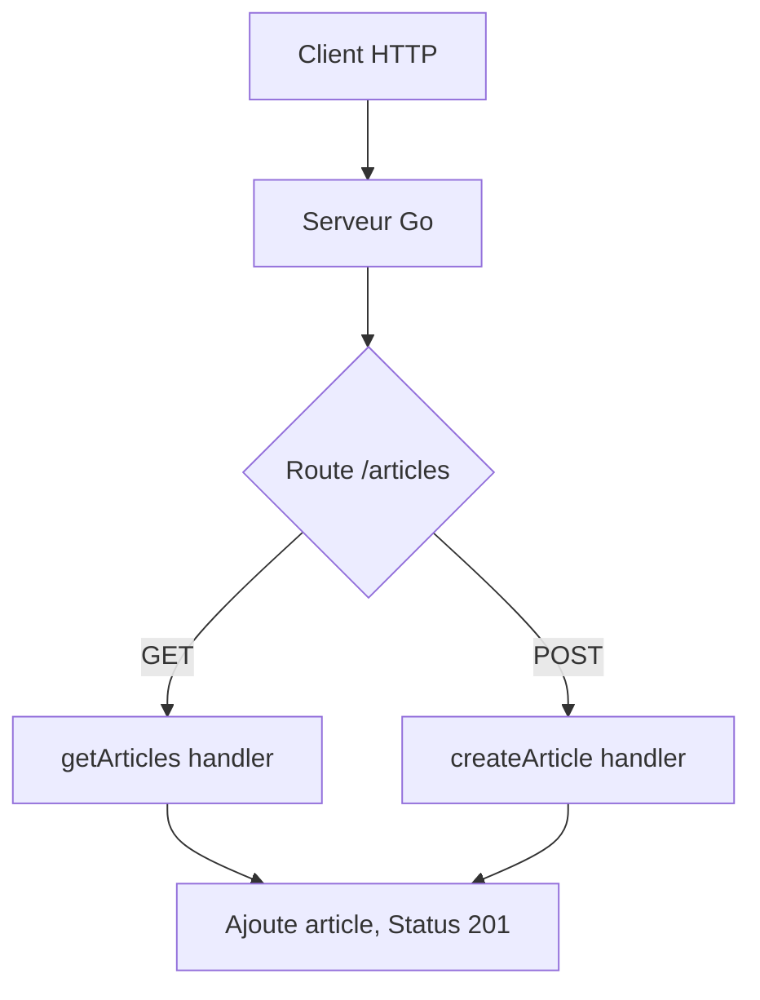

# 5- Développement d’API REST avec Go  
## 2- Création d’API REST  
### 1- Définir des routes et handlers  

---

## 1. Concepts fondamentaux  

Une API REST est constituée d’**endpoints** (routes) accessibles via différentes méthodes HTTP (GET, POST, PUT, DELETE, etc.).  

Chaque route est associée à un **handler**, une fonction qui traite la requête et génère une réponse.  

---

## 2. Définir une route et un handler avec `net/http`  

### Fonction handler  

Un handler HTTP en Go est une fonction avec la signature :  

```go
func(w http.ResponseWriter, r *http.Request)
```

- `w` permet d’écrire la réponse HTTP (statut, headers, corps).  
- `r` contient les données de la requête (méthode, URL, headers, body).

### Exemple simplifié

```go
package main

import (
    "fmt"
    "net/http"
)

func helloHandler(w http.ResponseWriter, r *http.Request) {
    if r.URL.Path != "/hello" {
        http.NotFound(w, r)
        return
    }
    if r.Method != http.MethodGet {
        http.Error(w, "Méthode non autorisée", http.StatusMethodNotAllowed)
        return
    }
    fmt.Fprintf(w, "Bonjour depuis /hello")
}

func main() {
    http.HandleFunc("/hello", helloHandler)
    http.ListenAndServe(":8080", nil)
}
```

---

## 3. Routes avec paramètres  

Le package `net/http` ne supporte pas les paramètres directement dans les routes (ex: `/users/{id}`).  

Il faut gérer manuellement en analysant `r.URL.Path` ou utiliser un routeur externe (comme [gorilla/mux](https://github.com/gorilla/mux) ou [Gin](https://gin-gonic.com/)).

### Exemple d’extraction manuelle 

```go
func userHandler(w http.ResponseWriter, r *http.Request) {
    id := strings.TrimPrefix(r.URL.Path, "/users/")
    fmt.Fprintf(w, "Utilisateur ID : %s", id)
}

func main() {
    http.HandleFunc("/users/", userHandler)
    http.ListenAndServe(":8080", nil)
}
```

---

## 4. Exemple complet avec route GET et POST  

```go
package main

import (
    "encoding/json"
    "io"
    "log"
    "net/http"
)

type Article struct {
    ID      string `json:"id"`
    Title   string `json:"title"`
    Content string `json:"content"`
}

var articles = []Article{}

func getArticles(w http.ResponseWriter, r *http.Request) {
    if r.Method != http.MethodGet {
        http.Error(w, "Méthode non autorisée", http.StatusMethodNotAllowed)
        return
    }
    w.Header().Set("Content-Type", "application/json")
    json.NewEncoder(w).Encode(articles)
}

func createArticle(w http.ResponseWriter, r *http.Request) {
    if r.Method != http.MethodPost {
        http.Error(w, "Méthode non autorisée", http.StatusMethodNotAllowed)
        return
    }

    body, err := io.ReadAll(r.Body)
    if err != nil {
        http.Error(w, "Corps de requête invalide", http.StatusBadRequest)
        return
    }
    defer r.Body.Close()

    var article Article
    if err := json.Unmarshal(body, &article); err != nil {
        http.Error(w, "JSON invalide", http.StatusBadRequest)
        return
    }

    articles = append(articles, article)
    w.WriteHeader(http.StatusCreated)
}
 
func main() {
    http.HandleFunc("/articles", func(w http.ResponseWriter, r *http.Request) {
        if r.Method == http.MethodGet {
            getArticles(w, r)
        } else if r.Method == http.MethodPost {
            createArticle(w, r)
        } else {
            http.Error(w, "Méthode non autorisée", http.StatusMethodNotAllowed)
        }
    })

    log.Println("Serveur démarré sur :8080")
    log.Fatal(http.ListenAndServe(":8080", nil))
}
```

---

## 5. Diagramme Mermaid — typage de routes et handlers



---

## 6. Bonnes pratiques  

- Associer **1 route = 1 fonction handler** pour clarté.  
- Toujours vérifier la **méthode HTTP** en début de handler.  
- Ajouter les **headers** HTTP adaptés (`Content-Type`, CORS, etc.).  
- Gérer proprement les erreurs et renvoyer un code HTTP correct.  
- Utiliser des routeurs tiers pour gestion avancée des routes et middlewares si besoin.  

---

## 7. Sources  

- Documentation officielle `net/http` : https://pkg.go.dev/net/http  
- Go Web Examples : https://gowebexamples.com/  
- Exemple de API REST avec Go : https://github.com/golang/go/wiki/WebFrameworks  

---

Ce cours présente comment définir des routes HTTP et écrire des handlers en Go, illustré par un exemple simple d’API REST GET/POST, avec la gestion manuelle des méthodes et le traitement JSON.