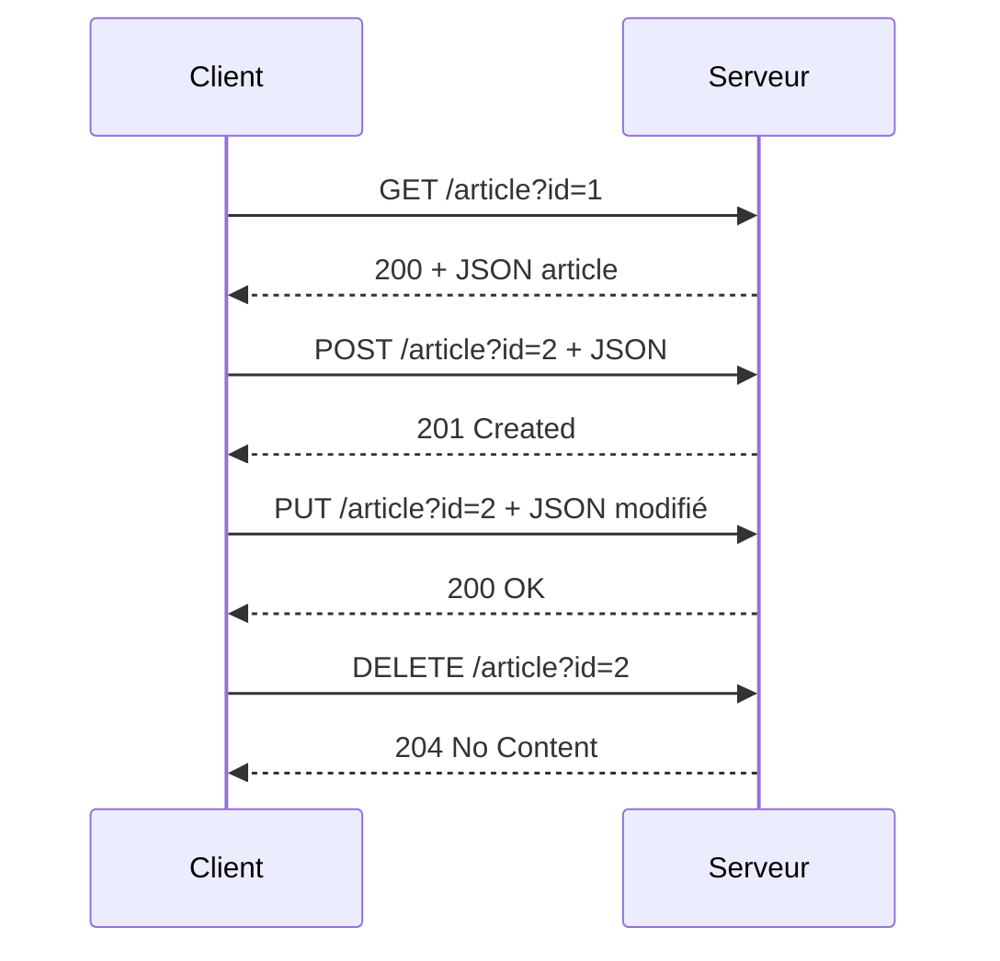

# 5- Développement d’API REST avec Go  
## 2- Création d’API REST  
### 2- Gérer les méthodes HTTP : GET, POST, PUT, DELETE  

---

## 1. Introduction aux méthodes HTTP  

Les méthodes HTTP définissent l'action à effectuer sur une ressource dans une API REST :  

| Méthode  | Usage principal                               | Idempotence   |
|----------|----------------------------------------------|---------------|
| **GET**    | Récupérer une ou plusieurs ressources        | Oui           |
| **POST**   | Créer une nouvelle ressource                   | Non           |
| **PUT**    | Mettre à jour complètement une ressource      | Oui           |
| **DELETE** | Supprimer une ressource                         | Oui           |

---

## 2. Gérer les méthodes dans Go avec `net/http`  

La requête entrante `*http.Request` possède la méthode HTTP dans `r.Method` (chaine). On la compare aux constantes disponibles dans `net/http` (`http.MethodGet`, etc.).

### Exemple simple : switch sur la méthode  

```go
func handler(w http.ResponseWriter, r *http.Request) {
    switch r.Method {
    case http.MethodGet:
        // Traitement GET
    case http.MethodPost:
        // Traitement POST
    case http.MethodPut:
        // Traitement PUT
    case http.MethodDelete:
        // Traitement DELETE
    default:
        http.Error(w, "Méthode non autorisée", http.StatusMethodNotAllowed)
    }
}
```

---

## 3. Exemple complet : CRUD basique sur une ressource "Article"  

```go
package main

import (
    "encoding/json"
    "io"
    "log"
    "net/http"
    "sync"
)

type Article struct {
    ID      string `json:"id"`
    Title   string `json:"title"`
    Content string `json:"content"`
}

var (
    articles = map[string]Article{}
    mu       sync.Mutex
)

func articleHandler(w http.ResponseWriter, r *http.Request) {
    mu.Lock()
    defer mu.Unlock()

    id := r.URL.Query().Get("id")
    if id == "" {
        http.Error(w, "ID requis", http.StatusBadRequest)
        return
    }

    switch r.Method {
    case http.MethodGet:
        article, exists := articles[id]
        if !exists {
            http.NotFound(w, r)
            return
        }
        w.Header().Set("Content-Type", "application/json")
        json.NewEncoder(w).Encode(article)

    case http.MethodPost:
        body, err := io.ReadAll(r.Body)
        if err != nil {
            http.Error(w, "Lecture body échouée", http.StatusBadRequest)
            return
        }
        defer r.Body.Close()

        var newArticle Article
        if err := json.Unmarshal(body, &newArticle); err != nil {
            http.Error(w, "JSON invalide", http.StatusBadRequest)
            return
        }

        if newArticle.ID == "" {
            newArticle.ID = id
        }
        articles[newArticle.ID] = newArticle
        w.WriteHeader(http.StatusCreated)

    case http.MethodPut:
        _, exists := articles[id]
        if !exists {
            http.NotFound(w, r)
            return
        }

        body, err := io.ReadAll(r.Body)
        if err != nil {
            http.Error(w, "Lecture body échouée", http.StatusBadRequest)
            return
        }
        defer r.Body.Close()

        var updated Article
        if err := json.Unmarshal(body, &updated); err != nil {
            http.Error(w, "JSON invalide", http.StatusBadRequest)
            return
        }

        updated.ID = id
        articles[id] = updated
        w.WriteHeader(http.StatusOK)

    case http.MethodDelete:
        _, exists := articles[id]
        if !exists {
            http.NotFound(w, r)
            return
        }
        delete(articles, id)
        w.WriteHeader(http.StatusNoContent)

    default:
        http.Error(w, "Méthode non autorisée", http.StatusMethodNotAllowed)
    }
}

func main() {
    http.HandleFunc("/article", articleHandler)
    log.Println("Serveur démarré sur :8080")
    log.Fatal(http.ListenAndServe(":8080", nil))
}
```

---

## 4. Points particuliers  

- Utilisation de mutex (`sync.Mutex`) pour protéger la map partagée.  
- Validation de données JSON entrantes.  
- Code status HTTP adapté (201 pour POST, 204 pour DELETE, etc.).  
- Passage de l’ID via query param (`/article?id=123`) pour simplicité.  

---

## 5. Diagramme Mermaid — Cycle CRUD via méthodes HTTP  



---

## 6. Sources  

- Documentation officielle `net/http` : https://pkg.go.dev/net/http  
- HTTP methods RFC 7231 : https://datatracker.ietf.org/doc/html/rfc7231#section-4.3  
- Go by Example - HTTP Servers : https://gobyexample.com/http-servers  
- Go blog - Writing Web Applications : https://go.dev/doc/articles/wiki/

---

Ce cours présente la gestion des principales méthodes HTTP dans une API REST avec Go, illustré par un exemple complet de gestion CRUD d’articles, avec validation, mutex et codes HTTP appropriés.