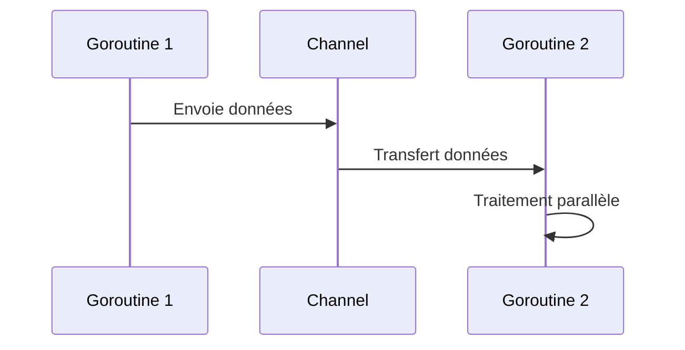

# 6- Découvrir les perspectives de Go (concurrence, microservices)  
## 1- Concurrence en Go  
### 1- Goroutines et channels  

---

## 1. Introduction à la concurrence en Go  

La concurrence en Go est native et intégrée au langage via deux mécanismes majeurs :  
- **Les goroutines** : exécution concurrente légère des fonctions.  
- **Les channels** : mécanisme de communication et de synchronisation entre goroutines.  

---

## 2. Goroutines  

Une **goroutine** est une fonction ou méthode qui s’exécute de manière concurrente, lancée avec l’instruction `go`.  

- Léger coût mémoire (~kilobytes) contrairement aux threads système.  
- Le runtime Go gère leur planification (scheduler M:N).  
- Permet d’exploiter efficacement les multi-cœurs.  

### Exemple simple  

```go
package main

import (
    "fmt"
    "time"
)

func sayHello() {
    for i := 0; i < 5; i++ {
        fmt.Println("Bonjour", i)
        time.Sleep(100 * time.Millisecond)
    }
}

func main() {
    go sayHello() // lancement concurrent
    time.Sleep(600 * time.Millisecond) // laisser le temps à la goroutine de s'exécuter
    fmt.Println("Fin du programme")
}
```

Sans `go`, `sayHello()` s’exécuterait avant la suite du main.

---

## 3. Channels  

Les **channels** permettent la communication sécurisée entre goroutines : passer des valeurs, synchroniser des actions.  

- Déclaré avec `make(chan Type)`.  
- Syntaxe d’envoi : `ch <- value`  
- Syntaxe de réception : `value := <- ch`  
- Channels bloquent l’émetteur si le canal est plein, et le récepteur si vide (synchronisation).  

### Exemple de communication  

```go
package main

import (
    "fmt"
)

func sum(nums []int, result chan int) {
    total := 0
    for _, n := range nums {
        total += n
    }
    result <- total // envoi du résultat dans le channel
}

func main() {
    nums := []int{1, 2, 3, 4, 5}
    result := make(chan int)

    go sum(nums, result) 

    val := <-result // réception du résultat
    fmt.Println("Somme :", val)
}
```

---

## 4. Channels bufferisés  

- Par défaut, channels non-bufferisés -> synchronisation stricte.  
- Channels bufferisés (`make(chan Type, taille)`) permettent un tampon, non bloquant tant que le buffer n’est pas plein.  

---

## 5. Sélection avec `select`  

`select` permet d’écouter plusieurs channels simultanément, et agir sur le channel prêt :

```go
select {
case val := <-ch1:
    fmt.Println("Reçu depuis ch1", val)
case ch2 <- 42:
    fmt.Println("Envoyé 42 sur ch2")
default:
    fmt.Println("Aucun channel prêt")
}
```

---

## 6. Diagramme Mermaid — communication entre goroutines  



---

## 7. Points importants  

| Élément     | Description                            |
|-------------|----------------------------------------|
| Goroutines  | Exécution concurrente légère (fonction) |
| Channels    | Passage de messages, synchronisation   |
| Blocage     | Channels synchronisent producteurs & consommateurs |
| Buffer      | Permet découpler producteurs et consommateurs |
| `select`    | Permet gérer plusieurs opérations en concurrence |

---

## 8. Sources  

- Documentation officielle Go - Goroutines : https://go.dev/doc/effective_go#goroutines  
- Documentation `channel` : https://go.dev/doc/effective_go#channels  
- Go by Example - Goroutines et Channels : https://gobyexample.com/concurrency  
- Blog Go: Patterns for Concurrent Programming : https://blog.golang.org/pipelines  

---

Ce cours explique le fonctionnement fondamental de la concurrence en Go à travers les goroutines et channels, avec des exemples clairs pour mettre en œuvre la communication concurrente sécurisée et efficace.