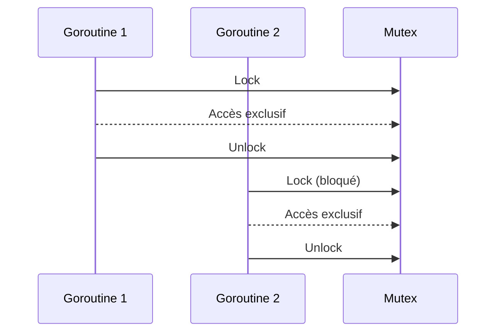

# 6- Découvrir les perspectives de Go (concurrence, microservices)  
## 1- Concurrence en Go  
### 2- Synchronisation basique  

---

## 1. Pourquoi synchroniser ?  

La concurrence en Go s’appuie sur l’exécution simultanée de **goroutines**. Lorsqu’elles partagent des ressources (variables, structures), il devient nécessaire de **synchroniser** l’accès pour éviter des conditions de course et garantir l’intégrité des données.  

---

## 2. Synchronisation avec `sync.Mutex`  

Le package `sync` fournit le type `Mutex` (verrou) pour protéger une section critique :  
- Seule une goroutine peut verrouiller un mutex à la fois.  
- Les autres goroutines attendent la libération pour accéder à la section protégée.  

### Exemple simple  

```go
package main

import (
    "fmt"
    "sync"
)

var (
    counter int
    mu      sync.Mutex
)

func increment(wg *sync.WaitGroup) {
    defer wg.Done()
    mu.Lock()
    counter++
    mu.Unlock()
}

func main() {
    var wg sync.WaitGroup

    for i := 0; i < 1000; i++ {
        wg.Add(1)
        go increment(&wg)
    }

    wg.Wait()
    fmt.Println("Counter final :", counter)
}
```

Sans mutex, le compteur pourrait être incrémenté incorrectement à cause de l'accès concurrent.

---

## 3. Attendre la fin des goroutines avec `sync.WaitGroup`  

`WaitGroup` permet de **synchroniser la fin d’un ensemble de goroutines**.  

- `Add(n)` indique le nombre de goroutines à attendre.  
- Chaque goroutine appelle `Done()` à sa fin.  
- Le `Wait()` bloque jusqu’à ce que le compteur atteigne zéro.  

Cet outil assure la coordination et la fin propre du programme.  

---

## 4. Autres primitives de synchronisation  

- `sync.RWMutex` : mutex optimisé lecture/écriture.  
- `sync.Once` : exécution unique d’un bloc même en concurrence.  
- `sync.Cond` : condition variable pour synchroniser selon un état.  

---

## 5. Exemple combiné `Mutex` + `WaitGroup`  

```go
package main

import (
    "fmt"
    "sync"
)

var (
    balance int
    mu      sync.Mutex
)

func deposit(amount int, wg *sync.WaitGroup) {
    defer wg.Done()
    mu.Lock()
    balance += amount
    mu.Unlock()
}

func main() {
    var wg sync.WaitGroup

    wg.Add(2)
    go deposit(100, &wg)
    go deposit(200, &wg)

    wg.Wait()
    fmt.Println("Solde final :", balance)
}
```

---

## 6. Diagramme Mermaid — synchronisation basique  



---

## 7. Points clés  

| Mécanisme       | Description                              |
|-----------------|------------------------------------------|
| `sync.Mutex`    | Verrou d’exclusion mutuelle             |
| `sync.WaitGroup`| Attente de fin de plusieurs goroutines  |
| Protection      | Permet éviter des races et accès concurrents |
| Bonne pratique  | Minimiser la section critique protégée   |

---

## 8. Sources  

- Documentation `sync` : https://pkg.go.dev/sync  
- Go by Example - Mutex : https://gobyexample.com/mutex  
- Go by Example - WaitGroup : https://gobyexample.com/waitgroups  
- Go Blog - Sharing Memory by Communicating : https://go.dev/blog/share  

---

Ce cours présente la synchronisation basique en Go, principalement via `sync.Mutex` et `sync.WaitGroup`, illustrée par des exemples pratiques pour prévenir les conditions de course et coordonner des goroutines.