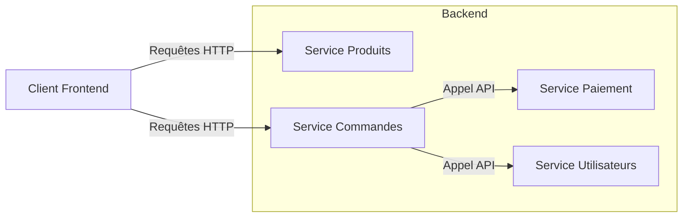

# 6- Découvrir les perspectives de Go (concurrence, microservices)  
## 2- Microservices et Go  
### 1- Architecture microservices  

---

## 1. Définition de l’architecture microservices  

L’architecture microservices est un style d’architecture logicielle où une application est décomposée en **petits services autonomes** — chacun étant responsable d’une fonctionnalité métier précise.  

Chaque microservice :  
- Est développé, déployé et scalé **indépendamment**.  
- Communique avec les autres via des API (souvent REST, gRPC...).  
- Possède sa propre base de données ou modèle de stockage, assurant un découplage fort.  

---

## 2. Avantages des microservices  

| Avantage              | Description                                   |
|-----------------------|-----------------------------------------------|
| Scalabilité           | Échelle précise sur services spécifiques       |
| Résilience            | Défauts isolés à un service sans casser tout   |
| Déploiement indépendant| Mises à jour plus rapides                       |
| Technologie mixte     | Possibilité de différents stacks tech par service |
| Organisation agile    | Équipes autonomes travaillant sur composantes distinctes |

---

## 3. Inconvénients et défis  

| Problème                   | Description                                            |
|----------------------------|--------------------------------------------------------|
| Complexité accrue          | Orchestration et gestion de nombreux services          |
| Communication réseau      | Latence, gestion des erreurs réseau                      |
| Transactions réparties     | Gestion des données distribuées et consistance          |
| Monitoring et debugging   | Nécessité d’outils spécifiques                           |

---

## 4. Pourquoi Go pour les microservices ?  

Go est particulièrement adapté aux microservices pour plusieurs raisons :  
- **Performance élevée** avec compilation native.  
- **Concurrence intégrée** avec goroutines idéale pour I/O asynchrone.  
- **Binary statique** et taille réduite facilitant le déploiement en conteneur.  
- **Écosystème riche** pour écrire des serveurs HTTP, clients gRPC, middlewares, etc.  
- **Simplicité du langage** encourageant un code clair et maintenable.

---

## 5. Exemple simplifié d’architecture microservices  

Imaginons une application e-commerce découpée en microservices :  

- **Service Produits** (catalogue)  
- **Service Commandes**  
- **Service Paiement**  
- **Service Utilisateurs**  

Chaque service expose une API HTTP/REST ou gRPC.



---

## 6. Architecture typique microservices avec Go  

- Chaque microservice écrit en Go possède :  
  - Un serveur HTTP ou gRPC léger.  
  - Des handlers/clients optimisés pour la communication inter-services.  
  - Usage courant de **Docker** pour containerisation.  

- Exemple d’une API Go simple exposée par un microservice (extrait) :

```go
package main

import (
    "net/http"
    "github.com/gin-gonic/gin"
)

func main() {
    r := gin.Default()
    r.GET("/products/:id", func(c *gin.Context) {
        id := c.Param("id")
        // Simuler récupération produit
        c.JSON(http.StatusOK, gin.H{"id": id, "name": "Produit X"})
    })
    r.Run(":8080")
}
```

---

## 7. Communications entre microservices  

- **REST/HTTP** : simple, largement supporté.  
- **gRPC** : hautes performances, bonnes pratiques sur schémas protobuf.  
- **Event-driven architectures** avec brokers (Kafka, NATS).  

Go dispose de bibliothèques solides pour ces protocoles et middleware.  

---

## 8. Monitoring et maintenance  

L’architecture microservices nécessite :  
- **Tracing distribué** (ex: Jaeger, OpenTelemetry)  
- **Logs centralisés** (ex: ELK stack)  
- **Health checks** intégrés dans les services.  

Go facilite la production de ces informations via sa simplicité et richesses des outils.  

---

## 9. Sources  

- [Martin Fowler - Microservices](https://martinfowler.com/articles/microservices.html)  
- [Go for Microservices - Manning](https://www.manning.com/books/go-for-microservices)  
- [Gin Web Framework](https://gin-gonic.com/)  
- [Google Cloud - Microservices avec Go](https://cloud.google.com/architecture/microservices-on-gcp)  
- [gRPC Go](https://grpc.io/docs/languages/go/)  

---

Cette présentation pose les bases de l’architecture microservices, expose ses avantages et défis, et met en lumière la manière dont Go se prête parfaitement au développement de microservices légers, rapides et maintenables.